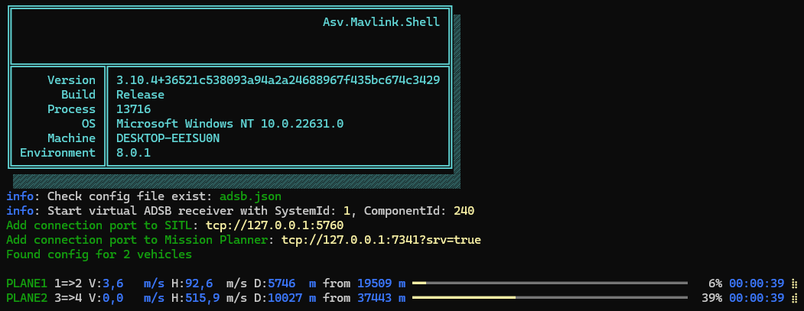
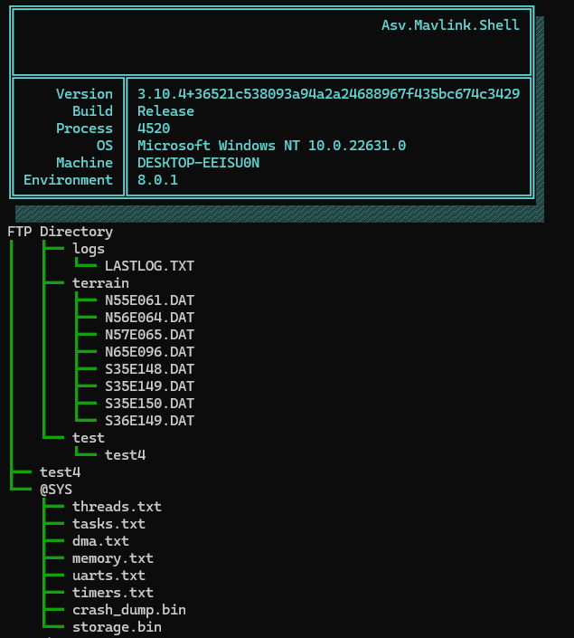
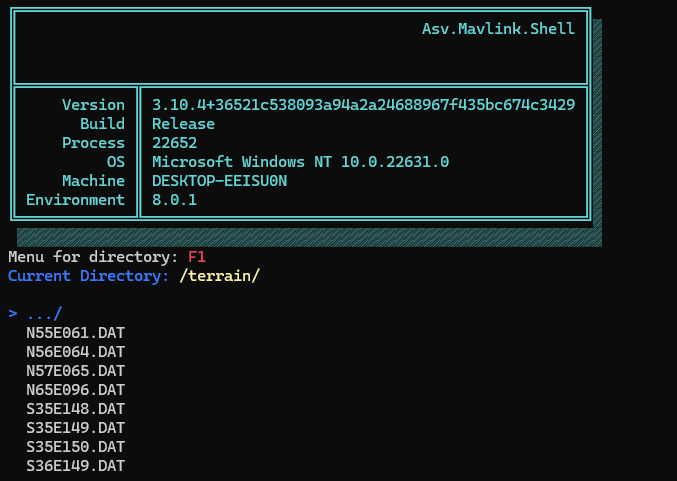
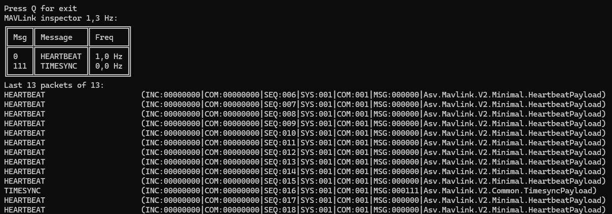
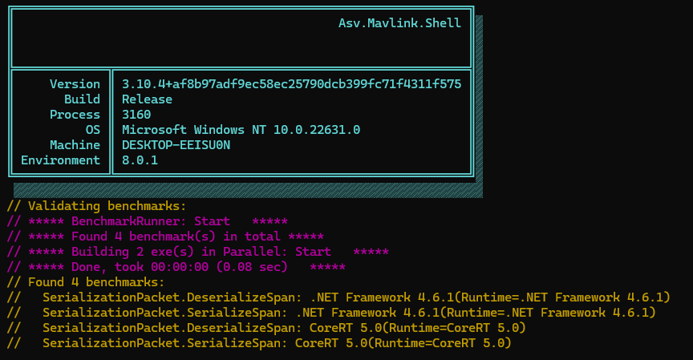

# 🧊 Asv.Mavlink

## Introduction

The [`asv-mavlink`](https://github.com/asv-soft/asv-mavlink) library provides a robust interface for communication with MAVLink compatible vehicles and payloads. This library is designed to facilitate the interaction with drones and other devices using the MAVLink protocol, enabling users to send commands, receive telemetry data, and perform various operations.

Additionally, the library includes a CLI utility [Asv.Mavlink.Shell](https://github.com/asv-soft/asv-mavlink/tree/main/src/Asv.Mavlink.Shell) for simulating, testing and code generation.

## Installation

To install the [`asv-mavlink`](https://github.com/asv-soft/asv-mavlink) library, you can use the following command:

```
dotnet add package Asv.Mavlink --version <Version>
```

## CLI: Emulate ADSB reciever

This command starts a virtual ADS-B receiver that sends [ADSB\_VEHICLE](https://mavlink.io/en/messages/common.html#ADSB\_VEHICLE) packets at a specified rate for every vehicle defined in the configuration file.

Executing this command launches an emulator for an ADS-B receiver, generating and transmitting ADSB\_VEHICLE data packets for virtual vehicles. These packets include information such as position, speed, and other ADS-B message parameters. The vehicles and their respective parameters are specified in the configuration file.

```bash
// run adsb simulator
Asv.Mavlink.Shell adsb -cfg adsb.json
```

<figure><figcaption><p>Asv.Mavlink.Shell.exe adsb output</p></figcaption></figure>

### Configuration file

If the configuration file does not exist, the command generates a default configuration file named `adsb.json` with two vehicles that fly in a box pattern over an airport.

#### Configuration file: Base properies

```json
{
    "SystemId": 1,         // Mavlink System ID for ADSB Receiver
    "ComponentId": 240,    // Mavlink Component ID for ADSB Receiver
    "Ports":[],            // Connection ports
    "Vehicles": []         // Vehicles and their routes
}
```

#### Configuration file: Connections

You can add multiple ports at once. All packets will be routed by other ports.

```json
  "Ports": [
    {
      "ConnectionString": "tcp://127.0.0.1:5760", // TCP client example
      "Name": "TCP client",
      "IsEnabled": true,
      "PacketLossChance": 0 // this is for packet loss testing. Must be 0.
    },
    {
      "ConnectionString": "tcp://127.0.0.1:7341?srv=true", // TCP server example
      "Name": "TCP server",
      "IsEnabled": true,
      "PacketLossChance": 0  
    },
    {
      "ConnectionString": "serial:COM1?br=115200", // Serial on Windows example
      "Name": "Serial on Windows",
      "IsEnabled": true,
      "PacketLossChance": 0
    },
    {
      "ConnectionString": "serial:/dev/ttyS0?br=115200", // Serial on Linux example
      "Name": "Serial on Linux",
      "IsEnabled": true,
      "PacketLossChance": 0
    },
    {
      "ConnectionString": "udp:127.0.0.1:7341?rhost=127.0.0.1&rport=7342", // UDP example
      "Name": "UDP",
      "IsEnabled": true,
      "PacketLossChance": 0
    }
  ]

```

#### Configuration file: Vehicles

Base properties are needed to fill [ADSB\_VEHICLE](https://mavlink.io/en/messages/common.html#ADSB\_VEHICLE). You can add multiple route points and different velocities for each point. Velocity will be interpolated between points. Latitude and Longitude can be in DMS or angle format (see [GeoPointLatitudeTest.cs](https://github.com/asv-soft/asv-common/blob/main/src/Asv.Common.Test/GeoPointLatitudeTest.cs) and [GeoPointLongitudeTest.cs](https://github.com/asv-soft/asv-common/blob/main/src/Asv.Common.Test/GeoPointLongitudeTest.cs)). Altitude is in meters. Velocity is in three dimensions in m/s. It will be separated by ground and vertical velocity if altitude between two route points is different. Velocity must be greater than 0.

```json
  "Vehicles": [
    {
      "CallSign": "PLANE1",   // Call sign ADSB_VEHICLE (max 9 char)
      "Squawk": 777,
      "UpdateRateMs": 500,    // Rate for sending ADSB_VEHICLE packets
      "IcaoAddress": 1234,    // 24 bit ICAO address (DEC format)
      "Route": [              // Vehicle mission points list (must be > 2)
        {
          "Lat": "55.305641", // Latitude at first point
          "Lon": "61.500886", // Longitude at first point
          "Alt": 250.0,       // Altitude at first point (m)
          "Velocity": 10.0    // Velocity at first point (m/s). Must be > 0
        },
        {
          "Lat": "55.362666", // Latitude at second point
          "Lon": "61.210466", // Latitude at second point
          "Alt": 1000.0,      // Altitude at second point (m)
          "Velocity": 300.0   // Velocity at second point (m/s). Must be > 0
        }
      ]
    },
    {
      "CallSign": "PLANE2",   // Second vehicle example
      ...
```

#### Here's an example of ADSB utility being used with [Asv.Drones](https://github.com/asv-soft/asv-drones).

<figure><figcaption><p>ADSB vehicles in Asv.Drones</p></figcaption></figure>

#### Here's an example of ADSB utility being used with [Mission Planner](https://ardupilot.org/planner/)

<figure><figcaption><p>ADSB vehicles in Mission Planner</p></figcaption></figure>

## CLI: Packet code generation

Generate C# code for packet serialization\deserialization

```bash
// run code gen
Asv.Mavlink.Shell gen -t=[mavlink-xml-file] -i=[mavlink-xml-folder] -o=[output-folder] -e=cs [path-to-liquid-template]/csharp.tpl
```

This command load XML file with mavlink packet definition

```xml
<message id="0" name="HEARTBEAT">
   <description>The heartbeat message shows that a system or component is present and responding. The type and autopilot fields (along with the message component id), allow the receiving system to treat further messages from this system appropriately (e.g. by laying out the user interface based on the autopilot). This microservice is documented at https://mavlink.io/en/services/heartbeat.html</description>
   <field type="uint8_t" name="type" enum="MAV_TYPE">Vehicle or component type. For a flight controller component the vehicle type (quadrotor, helicopter, etc.). For other components the component type (e.g. camera, gimbal, etc.). This should be used in preference to component id for identifying the component type.</field>
   <field type="uint8_t" name="autopilot" enum="MAV_AUTOPILOT">Autopilot type / class. Use MAV_AUTOPILOT_INVALID for components that are not flight controllers.</field>
   <field type="uint8_t" name="base_mode" enum="MAV_MODE_FLAG" display="bitmask">System mode bitmap.</field>
   <field type="uint32_t" name="custom_mode">A bitfield for use for autopilot-specific flags</field>
   <field type="uint8_t" name="system_status" enum="MAV_STATE">System status flag.</field>
   <field type="uint8_t_mavlink_version" name="mavlink_version">MAVLink version, not writable by user, gets added by protocol because of magic data type: uint8_t_mavlink_version</field>
</message>
```

And generate CSharp file, like this:

<pre class="language-csharp"><code class="lang-csharp"><strong>    /// &#x3C;summary>
</strong>    ///  HEARTBEAT
    /// &#x3C;/summary>
    public class HeartbeatPayload : IPayload
    {
        public byte GetMaxByteSize() => 9; // Sum of byte sized of all fields (include extended)
        public byte GetMinByteSize() => 9; // of byte sized of fields (exclude extended)
        public int GetByteSize()
        {
            var sum = 0;
            sum+=4; //CustomMode
            sum+= 1; // Type
            sum+= 1; // Autopilot
            sum+= 1; // BaseMode
            sum+= 1; // SystemStatus
            sum+=1; //MavlinkVersion
            return (byte)sum;
        }
        public void Deserialize(ref ReadOnlySpan&#x3C;byte> buffer)
        {
            CustomMode = BinSerialize.ReadUInt(ref buffer);
            Type = (MavType)BinSerialize.ReadByte(ref buffer);
            Autopilot = (MavAutopilot)BinSerialize.ReadByte(ref buffer);
            BaseMode = (MavModeFlag)BinSerialize.ReadByte(ref buffer);
            SystemStatus = (MavState)BinSerialize.ReadByte(ref buffer);
            MavlinkVersion = (byte)BinSerialize.ReadByte(ref buffer);
        }

        public void Serialize(ref Span&#x3C;byte> buffer)
        {
            BinSerialize.WriteUInt(ref buffer,CustomMode);
            BinSerialize.WriteByte(ref buffer,(byte)Type);
            BinSerialize.WriteByte(ref buffer,(byte)Autopilot);
            BinSerialize.WriteByte(ref buffer,(byte)BaseMode);
            BinSerialize.WriteByte(ref buffer,(byte)SystemStatus);
            BinSerialize.WriteByte(ref buffer,(byte)MavlinkVersion);
            /* PayloadByteSize = 9 */;
        }
        /// &#x3C;summary>
        /// A bitfield for use for autopilot-specific flags
        /// OriginName: custom_mode, Units: , IsExtended: false
        /// &#x3C;/summary>
        public uint CustomMode { get; set; }
        /// &#x3C;summary>
        /// Vehicle or component type. For a flight controller component the vehicle type (quadrotor, helicopter, etc.). For other components the component type (e.g. camera, gimbal, etc.). This should be used in preference to component id for identifying the component type.
        /// OriginName: type, Units: , IsExtended: false
        /// &#x3C;/summary>
        public MavType Type { get; set; }
        /// &#x3C;summary>
        /// Autopilot type / class. Use MAV_AUTOPILOT_INVALID for components that are not flight controllers.
        /// OriginName: autopilot, Units: , IsExtended: false
        /// &#x3C;/summary>
        public MavAutopilot Autopilot { get; set; }
        /// &#x3C;summary>
        /// System mode bitmap.
        /// OriginName: base_mode, Units: , IsExtended: false
        /// &#x3C;/summary>
        public MavModeFlag BaseMode { get; set; }
        /// &#x3C;summary>
        /// System status flag.
        /// OriginName: system_status, Units: , IsExtended: false
        /// &#x3C;/summary>
        public MavState SystemStatus { get; set; }
        /// &#x3C;summary>
        /// MAVLink version, not writable by user, gets added by protocol because of magic data type: uint8_t_mavlink_version
        /// OriginName: mavlink_version, Units: , IsExtended: false
        /// &#x3C;/summary>
        public byte MavlinkVersion { get; set; }
    }
</code></pre>

## CLI: Ftp tree

This command provides a tree representation of all available files and directories on the drone's FTP server. It allows users to see the entire file structure in a hierarchical format, making it easy to browse and understand the file layout without navigating through individual folders.

```bash
Asv.Mavlink.Shell.exe ftp-tree
```

### Features:
- Display the full directory structure of the drone's file system in a tree format.
- Automatically refreshes and loads the / and @SYS directories.
- Displays directories and files with visual guides for better clarity.


<figure><figcaption><p>Asv.Mavlink.Shell.exe ftp-tree output</p></figcaption></figure>


## CLI: Ftp browser

This command is a file manager for interacting with a drone's file system via FTP. It allows users to browse directories, view files, and perform various file operations (e.g., download, rename, remove, etc.) in an interactive console environment. The tool is designed for MAVLink-based systems and provides an intuitive way to manage the drone’s files and directories.

```bash
Asv.Mavlink.Shell.exe ftp-browser
```
### Features:
- FTP Connection: The command connects to a drone via TCP using a specified connection string, establishing an FTP client for file interactions.
- Tree Navigation: The file system is presented in a hierarchical structure using a tree model. The user can browse through directories interactively.
- File and Directory Operations: The user can:
  - Open directories. 
  - Remove, rename, or create directories. 
  - Perform file operations such as downloading, removing, truncating, renaming, and calculating CRC32.
<figure><figcaption><p>Asv.Mavlink.Shell.exe ftp-browser output</p></figcaption></figure>


## CLI: Export sdr data

This command extracts SDR (Software Defined Radio) data from a binary file and exports it into a CSV format. The SDR data is deserialized using the AsvSdrRecordDataLlzPayload class, and each record is written as a row in the CSV file with specific data fields such as altitude, signal strength, and power levels.

### Features:

- Reads binary SDR data from an input file.
- Exports the data to a CSV file for further analysis or storage.
- Provides a simple and automated way to convert SDR logs into human-readable tabular data.
```bash
Asv.Mavlink.Shell.exe export-sdr
```

You may also use some parameters in the command.
```bash
Usage: export-sdr [options...] [-h|--help] [--version]

Export sdt data to csv format

Options:
-i|--input-file <string>     Input file (Required)
-o|--output-file <string>    Output file (Default: @"out.csv")
```
<figure><figcaption><p>Asv.Mavlink.Shell.exe export-sdr</p></figcaption></figure>


## CLI: Mavlink

This command listens to incoming MAVLink packets and displays statistics on the received messages. It allows monitoring of the communication between a ground station and an unmanned vehicle, showing information like the frequency of each type of message and the last few received packets.

### Features:

- Connects to a MAVLink stream via the provided connection string.
- Displays statistics such as message ID, message frequency, and the last received packets
- Continually updates the display with real-time data and allows the user to stop the process by pressing 'Q'.

```bash
Asv.Mavlink.Shell.exe mavlink
```

You may also use some parameters in the command.
```bash
Usage: mavlink [options...] [-h|--help] [--version]

Listen MAVLink packages and print statistic

Options:
  -cs|--connection <string>    Connection string. Default "tcp://127.0.0.1:5760" (Default: null)
```

<figure><figcaption><p>Asv.Mavlink.Shell.exe mavlink</p></figcaption></figure>

## CLI: Proxy

This command is used to connect a vehicle with multiple ground stations, creating a hub that routes MAVLink messages between them. It provides flexible filtering options to log specific MAVLink messages, and can output the filtered data to a file. It supports multiple connections (UDP or serial) and can operate in silent mode (without printing to the console).
### Features:

- Connects to multiple MAVLink streams, allowing you to route messages between different systems (e.g., vehicle and multiple ground stations).
- Supports filtering by system ID, message ID, message name (using regex), and message content (JSON text).
- Can log filtered MAVLink messages to a file.
- Allows disabling console output for silent operation.
- Automatically propagates MAVLink messages between the connected links.

```bash
Asv.Mavlink.Shell.exe proxy -l tcp://127.0.0.1:5762 -l tcp://127.0.0.1:7341 -o out.txt
```

You may also use some parameters in the command.
```bash
Usage: proxy [options...] [-h|--help] [--version]

Used for connecting vehicle and several ground station
     Example: proxy -l udp://192.168.0.140:14560 -l udp://192.168.0.140:14550 -o out.txt

Options:
  -l|--links <string[]>            Add connection to hub. Can be used multiple times. Example: udp://192.168.0.140:45560 or serial://COM5?br=57600 (Required)
  -o|--output-file <string>        Write filtered message to file (Default: null)
  -silent|--silent                 Disable print filtered message to screen (Optional)
  -sys|--sys-ids <int[]>           Filter for logging: system id field (Example: -sys 1 -sys 255) (Default: null)
  -id|--msg-ids <int[]>            Filter for logging: message id field (Example: -id 1 -mid 255) (Default: null)
  -name|--name-pattern <string>    Filter for logging: regex message name filter (Example: -name MAV_CMD_D) (Default: null)
  -txt|--text-pattern <string>     Filter for logging: regex json text filter (Example: -txt MAV_CMD_D) (Default: null)
  -from|--directions <int[]>       Filter for packet direction: select only input packets from the specified direction (Default: null)
```

## CLI: Benchmark-serialization

This command benchmarks the serialization and deserialization performance of MAVLink packets. It uses BenchmarkDotNet to measure the efficiency of the serialization process, focusing on how MAVLink packets are serialized and deserialized using spans.### Features:

- Connects to multiple MAVLink streams, allowing you to route messages between different systems (e.g., vehicle and multiple ground stations).
- Supports filtering by system ID, message ID, message name (using regex), and message content (JSON text).
- Can log filtered MAVLink messages to a file.
- Allows disabling console output for silent operation.
- Automatically propagates MAVLink messages between the connected links.

```bash
Asv.Mavlink.Shell.exe benchmark-serialization
```

<figure><figcaption><p>Asv.Mavlink.Shell.exe benchmark-serialization</p></figcaption></figure>


## CLI: Benchmark-serialization

This command benchmarks the serialization and deserialization performance of MAVLink packets. It uses BenchmarkDotNet to measure the efficiency of the serialization process, focusing on how MAVLink packets are serialized and deserialized using spans.### Features:

- Connects to multiple MAVLink streams, allowing you to route messages between different systems (e.g., vehicle and multiple ground stations).
- Supports filtering by system ID, message ID, message name (using regex), and message content (JSON text).
- Can log filtered MAVLink messages to a file.
- Allows disabling console output for silent operation.
- Automatically propagates MAVLink messages between the connected links.

```bash
Asv.Mavlink.Shell.exe benchmark-bin-serialize
```

<figure><figcaption><p>Asv.Mavlink.Shell.exe benchmark-bin-serialize</p></figcaption></figure>

## CLI: Devices info
This command shows info about the mavlink device and all other mavlink devices that are connected to it.

```bash
Asv.Mavlink.Shell.exe devices-info -cs "tcp://127.0.0.1:7341"
```


You may also use some parameters in the command to customise the output
```bash
Usage: devices-info [options...] [-h|--help] [--version]

Command that shows info about devices in the mavlink network

Options:
-cs|--connection-string <string>    The address of the connection to the mavlink device (Required)
-i|--iterations <uint?>             States how many iterations should the program work through (Default: null)
-dt|--devices-timeout <uint>        (in seconds) States the lifetime of a mavlink device that shows no Heartbeat (Default: 10)
-r|--refresh-rate <uint>            (in ms) States how fast should the console be refreshed (Default: 3000)
```

Full possible command with all the parameters
```bash
Asv.Mavlink.Shell.exe devices-info -cs "tcp://127.0.0.1:7341" -i 400 -dt 20 -r 1000
```
