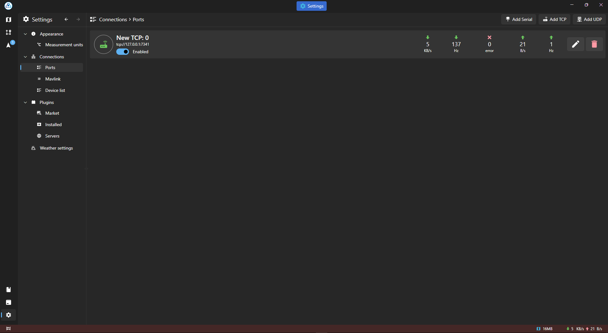

### Connecting a Drone

#### Overview

Connecting your drone to Asv.Drones is a straightforward process that involves creating a TCP client port through the "Connections" tab. This establishes a communication link between the software and your drone, enabling seamless control and data exchange during missions.

#### Steps to Connect a Drone

1. **Open Asv.Drones:**
   - Launch Asv.Drones on your device.

2. **Navigate to the "Connections" Tab:**
   - Locate and click on the "Connections" tab in the main menu.

3. **Create a New TCP Client Port:**
   - Within the "Connections" tab, find the option to create a new TCP port.
   - Choose "TCP Client" as the connection type.

4. **Configure Connection Settings:**
   - Enter the necessary details, including port name, the drone's IP address and port number.
   - Ensure that the specified port is open and accessible for communication.

5. **Save and Activate Connection:**
   - Save the configuration settings.
   - Activate the connection to establish a link between Asv.Drones and the drone.

6. **Verify Connection Status:**
   - Check the connection status to confirm a successful link.
   - If the connection is established, you are ready to control and monitor your drone using Asv.Drones.

#### Additional Considerations

- **Firewall Settings:**
  - Ensure that any firewall or security software on your device allows communication through the specified port.

- **Drone Compatibility:**
  - Confirm that your drone is compatible with Asv.Drones. Check for specific compatibility requirements in the drone's documentation.

- **Telemetry Data:**
  - Once connected, the software will start receiving real-time telemetry data from the drone, providing insights into its status and performance.

#### Troubleshooting

If you encounter issues during the connection process, ensure that the drone is powered on, within range, and the specified connection details are accurate.

### Example Configuration:

- **Port title:** My new port
- **IP Address:** 127.0.0.1
- **Port Number:** 5762
- **Connection Type:** TCP Client

By following these steps, you can establish a reliable connection between Asv.Drones and your drone, unlocking the full potential of the software for mission planning, control, and data analysis.