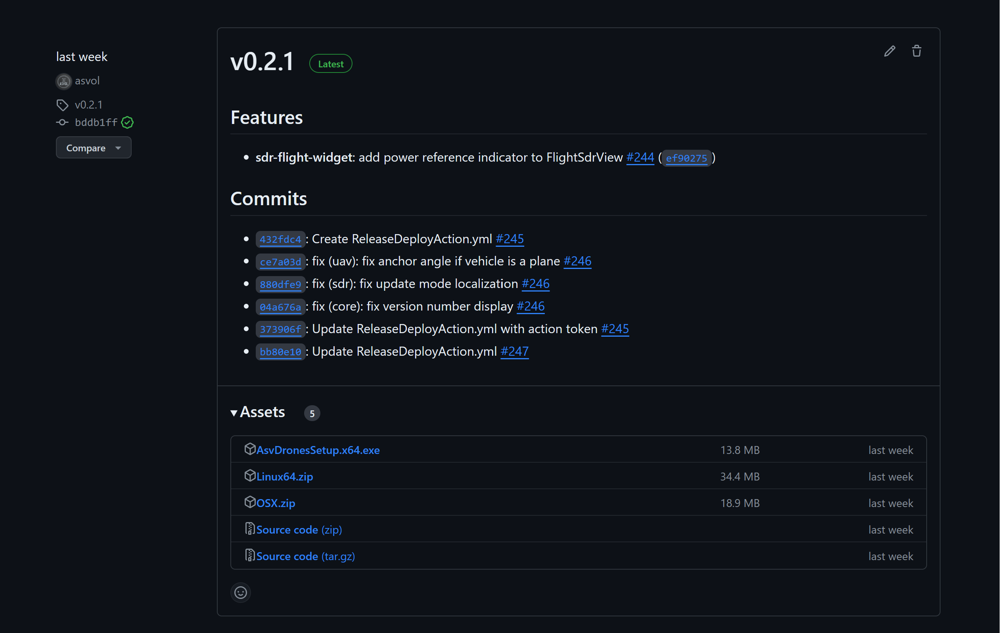

### Downloading and Installing Asv.Drones

#### Downloading the Installation Package

1. **Visit the GitHub Releases Page:**
   - Open your web browser and navigate to the [GitHub Releases page](https://github.com/asv-soft/asv-drones/releases) for Asv.Drones.

2. **Select the Latest Release:**
   - Locate the latest release of Asv.Drones on the GitHub page. Releases are typically tagged with version numbers.

3. **Choose the Correct Platform:**
   - Under the assets section of the release, find the installation package for your operating system (Windows, Linux, or macOS).
   - Click on the relevant download link to initiate the download.

4. **Wait for the Download to Complete:**
   - Depending on your internet connection, the download may take a few moments. Ensure that the download is complete before proceeding.



#### Installing Asv.Drones

**Windows:**

1. **Run the Installer:**
   - Locate the downloaded installation package (.exe file) on your computer.
   - Double-click the installer to run it.

2. **Follow the Installation Wizard:**
   - The installation wizard will guide you through the installation process.
   - Accept the terms and conditions, choose the installation directory, and click "Install."

3. **Wait for Installation to Complete:**
   - The installer will copy the necessary files and configure the application.
   - Once completed, click "Finish" to exit the installer.

**Linux:**

   **For Debian systems**:
   * Open terminal and navigate to downloaded .deb package.
   * Execute following command (replace packet_name with real packet name):
      ```
      sudo dpkg -i packet_name.deb
      ```
   
   **For RedHat systems**:
   * Open terminal and navigate to downloaded .deb package.
   * If you using rpm - execute following command (replace packet_name with real packet name):
      ```
      sudo rpm -ivh packet_name.rpm
      ```
   * If you using dnf - execute following command (replace packet_name with real packet name):
      ```
      sudo dnf install packet_name.rpm
      ```

**macOS:**

1. **Open the Disk Image:**
   - Locate the downloaded disk image (.dmg file) and double-click it to open.

2. **Drag Asv.Drones to Applications:**
   - In the opened window, drag the Asv.Drones icon to the "Applications" folder.

3. **Wait for Copying to Complete:**
   - The application will be copied to the "Applications" folder.
   - Once completed, you can eject the disk image.

#### Verifying the Installation

1. **Launch Asv.Drones:**
   - Find Asv.Drones in your applications or start menu.
   - Launch the application.

2. **Check for Updates:**
   - After installation, it's recommended to check for updates on the GitHub releases page periodically.

Now, you have successfully downloaded and installed Asv.Drones on your computer. Start exploring the features and capabilities outlined in this documentation to make the most of your drone management experience.