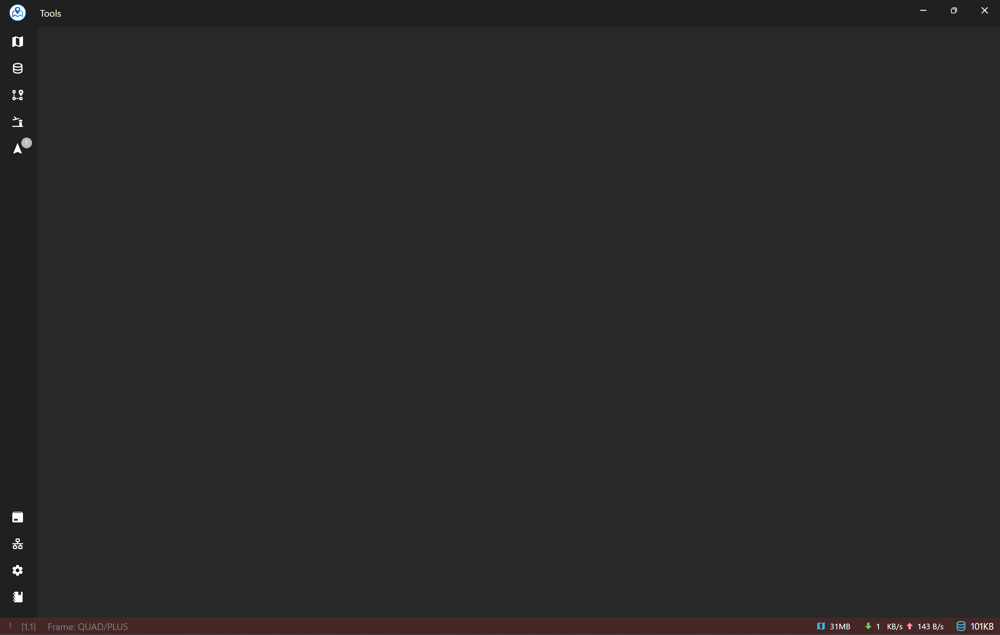

### Application User Interface Overview

#### General Layout

Asv.Drones features an intuitive and organized user interface designed to enhance user experience and streamline access to key functionalities. The interface consists of several key components:

1. **Navigation Menu (Left Sidebar):**
   - Located on the left side of the application, the navigation menu provides quick access to different sections and pages. It includes options such as Flight Mode, Settings, Connections, Packet Viewer, Log Messages, SDR Store, and more.

2. **Toolbar (Top):**
   - The toolbar is positioned at the top of the application, offering a set of tools and shortcuts for common actions. This includes tools like the Coordinates Calculator and Templater.

3. **Main Content Area:**
   - Situated in the center of the application, the main content area dynamically displays the content of the currently selected page. Whether you are planning a mission or configuring settings, this area adapts to provide relevant information and controls.

4. **Status Bar (Bottom):**
   - The status bar is located at the bottom of the application, providing essential information about the current state of the software, connection status with drones, and other relevant details.

#### Navigation Menu

The Navigation Menu serves as the primary hub for accessing different sections of the application. Clicking on a menu item opens the corresponding page in the main content area. Common menu items include:

- **Flight Mode:** Access controls and features related to drone flight.
- **Settings:** Configure general application settings.
- **Connections:** Manage and establish connections with drones.
- **Mission Planning:** Create, edit, and execute drone missions.
- **Packet Viewer:** Explore and analyze communication packets between the software and connected devices.
- **Log Messages:** View and analyze system log messages.
- **SDR Store:** Manage and configure Software-Defined Radio (SDR) payloads.

#### Toolbar

The Toolbar offers quick access to essential tools and features. Icons and buttons on the toolbar correspond to specific actions, providing an efficient way to interact with the software. Common tools include:

- **Coordinates Calculator:** Calculate geographical coordinates based on user input.
- **Templater:** Access and utilize templates for mission planning and configuration.

#### Main Content Area

The Main Content Area is dynamic and adapts to the selected page or section. Depending on the user's choice from the Navigation Menu, this area displays relevant information, controls, and visualizations. For example:

- **Flight Mode Page:** Displays a real-time view of drone telemetry data and flight controls.
- **Settings Page:** Provides options for configuring application settings.
- **Connections:** Configure connections with drones.
- **Mission Planning:** Create, edit, and execute drone missions.
- **Packet Viewer Page:** Allows users to analyze communication packets.
- **Log Messages Page:** Displays system log messages.
- **SDR Store Page:** Manages and configures Software-Defined Radio (SDR) payloads.

#### Status Bar

The Status Bar at the bottom of the application provides crucial information about the current state. This includes:

- **Connection Status:** Indicates whether the software is connected to a drone.
- **Data Usage:** Displays the size of map and SDR storage.

#### Customization and Themes

Asv.Drones offers customization options, including theme selection and layout preferences. Users can tailor the appearance and organization of the interface to suit their preferences.

By leveraging this organized and intuitive interface, users can navigate seamlessly through Asv.Drones, accessing powerful features for drone management and mission planning.