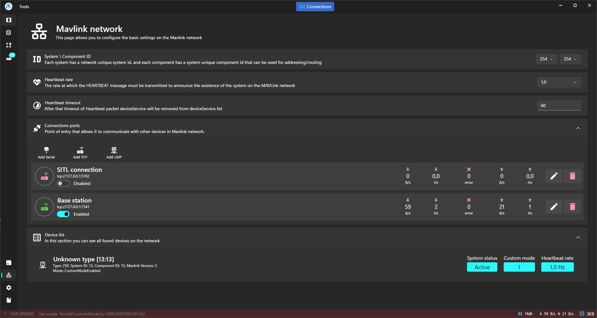
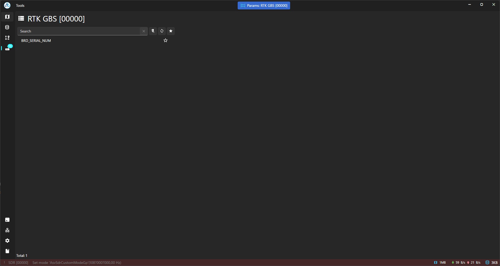
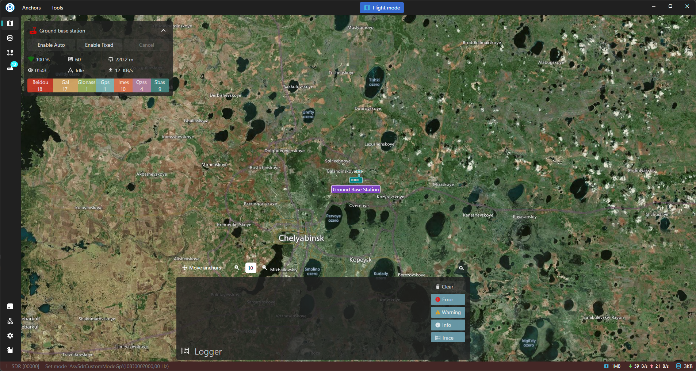
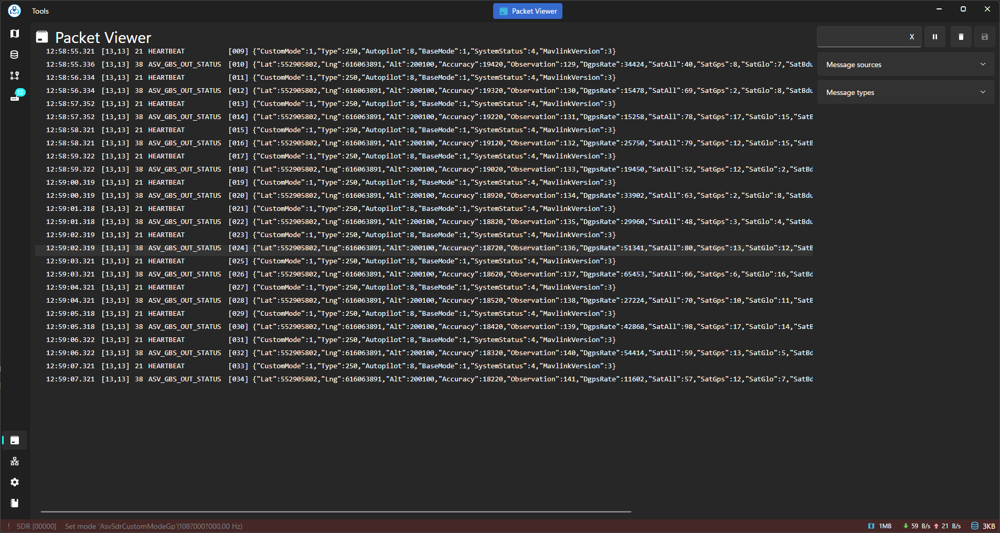

# Example Of Usage With GBS

**Ground Base Station Integration:** Asv.Drones offers seamless integration with ground base stations through our proprietary implementation called Asv.Drones.Gbs, available on GitHub [here](https://github.com/asv-soft/asv-drones-gbs). Built to operate via the MAVLink protocol, Asv.Drones.Gbs allows users to remotely manage and monitor drone operations from a centralized platform. Moreover, any other ground base station software compatible with MAVLink can seamlessly interface with our application, ensuring flexibility and interoperability across different systems (development of additional UI controls may be required). With Asv.Drones.Gbs, users can plan missions, monitor telemetry data, and adjust flight parameters with ease.

<figure><figcaption>
Connecting to GBS
</figcaption></figure>

<figure><figcaption>
GBS parameters
</figcaption></figure>

<figure><figcaption>
GBS widget
</figcaption></figure>

<figure><figcaption>
GBS data in Packet Viewer
</figcaption></figure>

