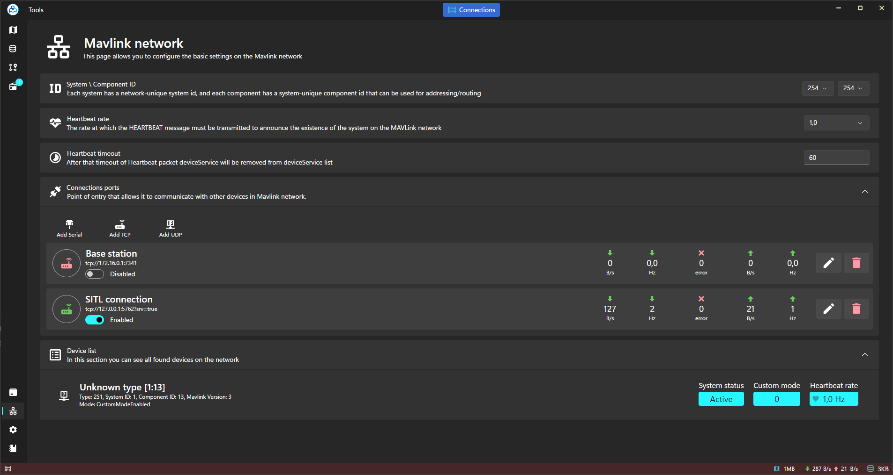
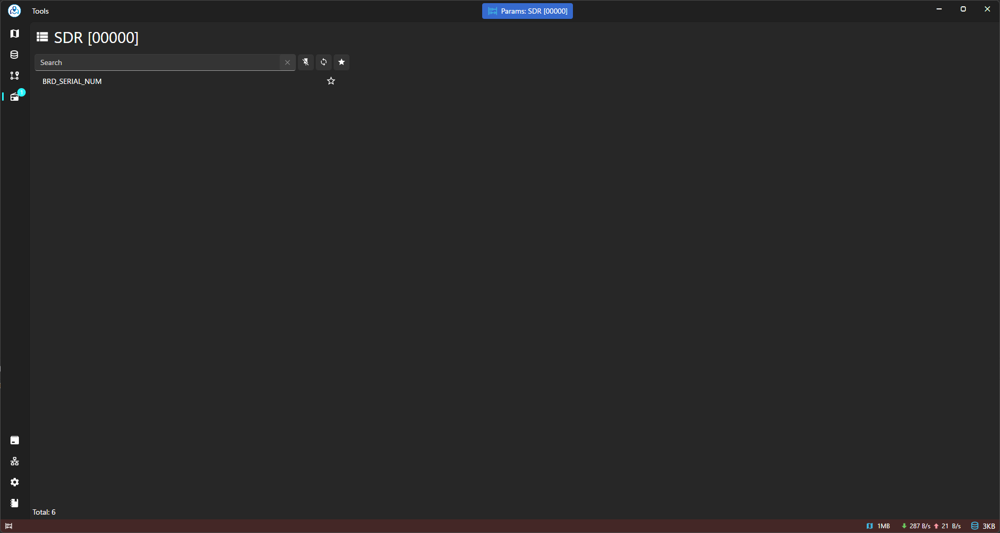
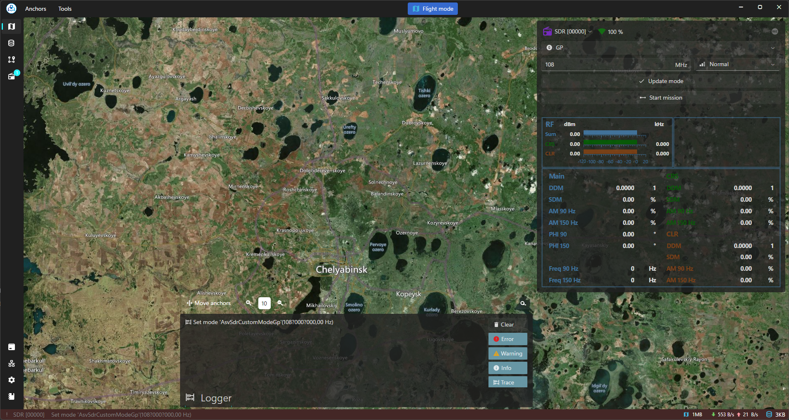
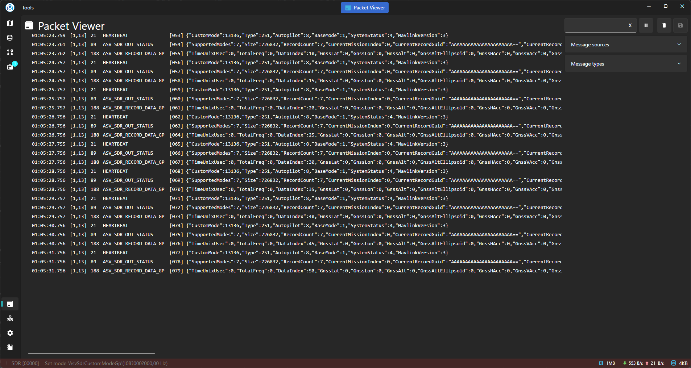

# Example Of Usage With SDR

**SDR Integration:** Enhance your drone operations with Asv.Drones.Sdr, our custom-built SDR software available on GitHub [here](https://github.com/asv-soft/asv-drones-sdr). Designed to communicate via the MAVLink protocol, Asv.Drones.Sdr expands the capabilities of your drones beyond traditional control. Additionally, our software allows integration with any other SDR software that utilizes MAVLink, enabling a wide range of applications such as spectrum monitoring, signal intelligence, and radio relay (development of additional UI controls may be required). With Asv.Drones.Sdr, users can leverage SDR technology to scan and analyze radio frequency signals, intercept communication signals, and extend communication networks, empowering them to tackle diverse missions effectively.

<figure><figcaption>
Connecting to SDR
</figcaption></figure>

<figure><figcaption>
SDR parameters
</figcaption></figure>

<figure><figcaption>
SDR widget
</figcaption></figure>

<figure><figcaption>
SDR data in Packet Viewer
</figcaption></figure>
