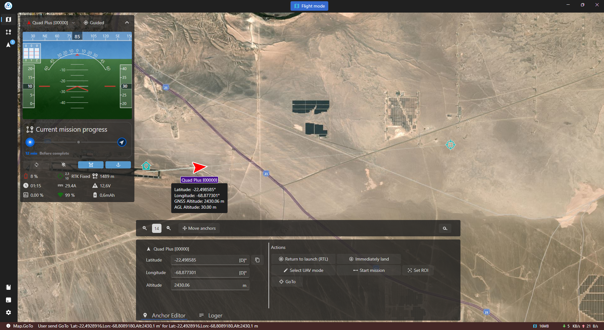

### Flight Mode Page

#### Overview

The Flight Mode page in Asv.Drones provides a dynamic and interactive environment for monitoring and controlling drones in real-time. Central to this page is a world map that serves as a visual representation of drone locations and connected devices.

#### World Map

- **Anchors and Devices:**
  - The world map displays anchors representing drones and other connected devices.

- **Interactive Anchors:**
  - Users can interact with anchors by clicking on them, revealing additional information and options related to the corresponding drone or device.
  - Many anchors in close area? Right click there to open context menu and select the anchor you need.

#### Widget Layout

The Flight Mode page is designed with dedicated spaces for different types of widgets, providing a comprehensive view of telemetry data, SDR information, and logs.

- **Left Sidebar Widgets:**
  - **Telemetry Widgets:** Display real-time telemetry data for drones and [ground base stations](https://github.com/asv-soft/asv-drones-gui-plugin-gbs). Information includes altitude, speed, battery level, and other relevant metrics.
  
- **Bottom Widgets:**
  - **Log Widget:** Displays system logs and messages, allowing users to monitor important events and notifications during drone operations.
  - **Anchors Editor Widget:** Empty until any anchor on the map is selected. It allows editing of anchor's location and altitude if the selected anchor is editable and the Move Anchors toggle is active. Use this widget to control your UAV - all available actions are displayed here.

#### Additional Functionalities
- **Zoom Controls:**
  - Users can adjust the map zoom level to focus on specific areas of interest.

- **Anchor Movement Toggle:**
  - The Flight Mode page allows users to toggle anchor movement, enabling or disabling the automatic adjustment of anchor positions based on real-time data.

- **Ruler Tool:**
  - The ruler tool provides a convenient way to measure ground distances on the map. Users can place two markers on the map, and the tool will display the distance between them, aiding in mission planning and navigation.

By leveraging the Flight Mode page, users can actively monitor and control drones, access real-time telemetry data, and make informed decisions during missions.