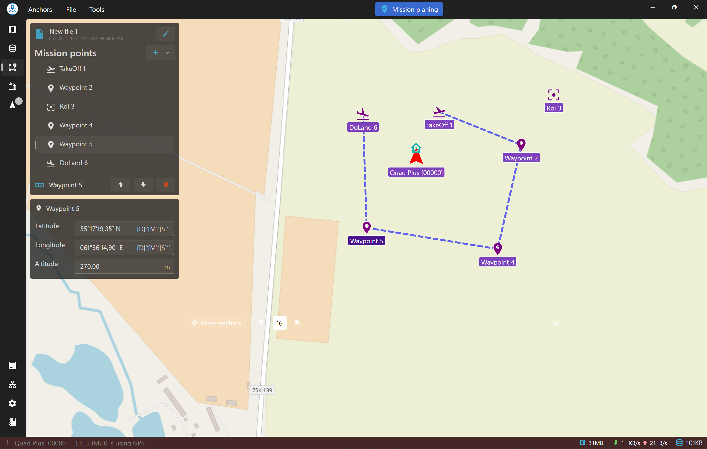

### Mission Planning Page

#### Overview

The Mission Planning page in Asv.Drones empowers users to create, edit, and manage drone missions with ease. This page facilitates the seamless design of mission paths, incorporating various mission points and optimizing flight plans.

#### Workflow

1. **File Operations:**
   - Users initiate mission planning by opening an existing mission file or creating a new one through the File menu in the Toolbar.

2. **Mission Planning Widget:**
   - Once a mission is initiated, the Mission Planning widget appears on the left side of the page. This widget serves as the central workspace for creating and manipulating mission points.

3. **Adding Mission Points:**
   - Users can add different mission points to the planning widget, including Take Off, Do Land, Waypoint, and Region of Interest (ROI). These points define key actions and locations within the mission.

4. **Move Anchors Toggle:**
   - Enabling the Move Anchors toggle allows users to dynamically adjust the positions of mission points on the map, providing flexibility in refining the mission path.

5. **Selecting and Modifying Points:**
   - Users can select mission points within the planning widget to change their order or delete them. This enables fine-tuning and customization of the mission sequence.

6. **Saving and Uploading:**
   - Once the mission is finalized, users can save it locally or upload it to connected drones using the File menu. If at least one drone is connected, the mission can be uploaded directly for execution.

7. **Downloading Existing Missions:**
   - If there are already missions uploaded on the connected drone, users can download them to review, modify, or execute.

#### Widgets and Tools

- **Mission Planning Widget:**
  - The central workspace for mission creation, displaying a visual representation of the mission path with editable mission points.

- **Anchors Editor Widget:**
  - Appears when the user selects any anchor on the map. It allows the user to edit the anchor's location and altitude if the selected anchor is editable, and the Move Anchors toggle is active. 

- **Move Anchors Toggle:**
  - Enables or disables the ability to move mission points within the planning widget.

#### User Interactions

- **Adding Mission Points:**
  - Users can add mission points by selecting the desired point type (Take Off, Do Land, Waypoint, ROI) and clicking on the mission planning widget.

- **Adjusting Mission Points:**
  - Enabling the Move Anchors toggle allows users to click and drag mission points to refine their positions.

- **Order Modification:**
  - Users can select mission points in the planning widget to change their order, optimizing the mission sequence.

- **Saving and Uploading:**
  - Through the File menu, users can save the mission locally or upload it to connected drones for execution.

- **Downloading Existing Missions:**
  - If connected to a drone with existing missions, users can download them for review or modification.

#### Example Scenario

1. **Creating a New Mission:**
   - The user opens a new mission file and starts adding waypoints and actions using the Mission Planning widget.

2. **Refining the Mission Path:**
   - The user enables the Move Anchors toggle to fine-tune the positions of waypoints and optimize the mission path.

3. **Saving and Uploading:**
   - Once satisfied with the mission plan, the user saves the mission locally or uploads it to the connected drone for execution.

4. **Downloading Existing Missions:**
   - The user explores and downloads existing missions from the connected drone for further analysis or modification.

By leveraging the Mission Planning page, users can efficiently design drone missions, incorporating key actions and waypoints to achieve specific objectives.