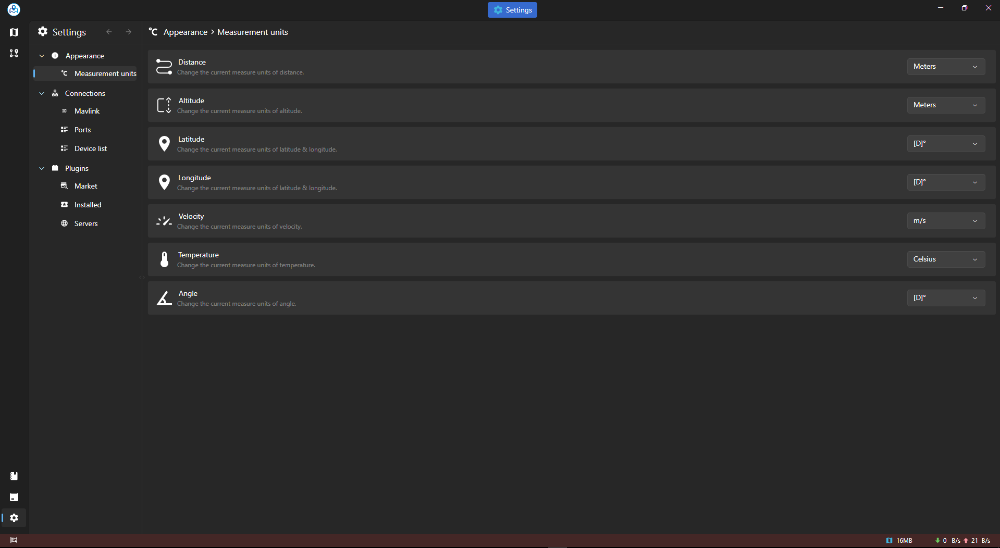
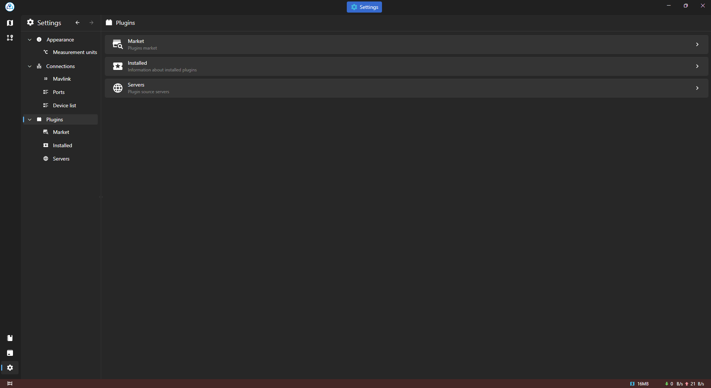
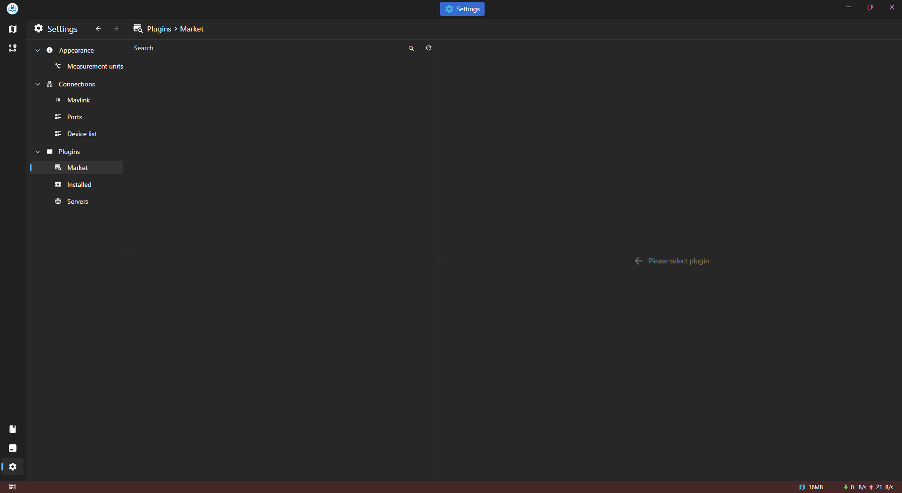
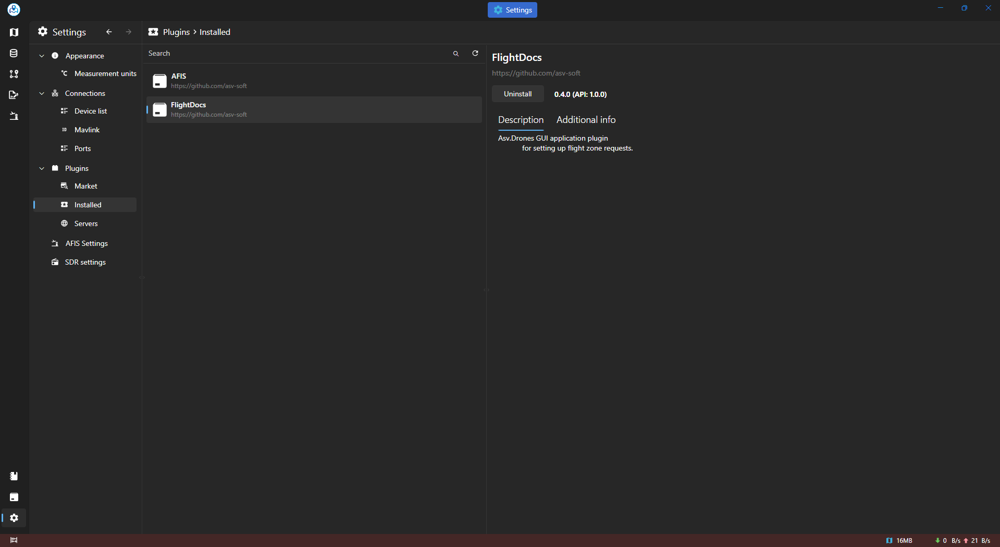
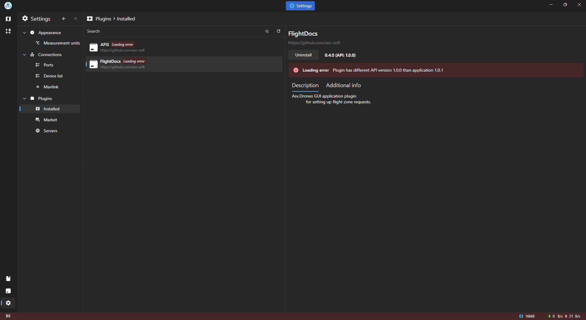
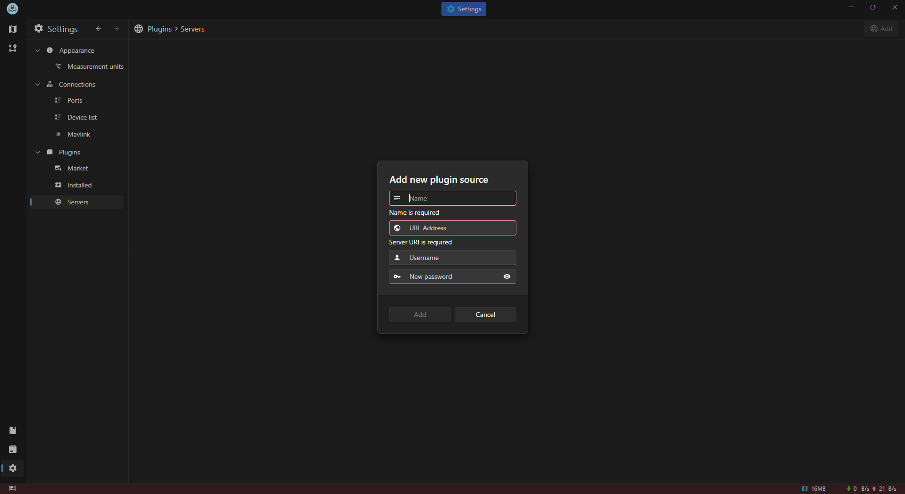

### Settings Page

#### Overview

The Settings page in Asv.Drones offers users the flexibility to personalize their experience by adjusting various parameters and preferences. From visual themes to measurement units and SDR settings, users can tailor the application to suit their preferences.

#### Theme and Language

- **Theme:**
  - Users can choose between Dark and Light themes, customizing the visual appearance of the application to their preference.

- **Language:**
  - Currently supporting English and Russian, users can select their preferred language for the application's interface.

#### Map Settings

- **Map Provider:**
  - Users can choose their preferred map provider from a list of supported providers, allowing them to customize the map view according to their preferences.

- **Clear Local Map Storage:**
  - In this section, users have the option to clear local map storage if needed, providing control over cached map data.

#### Measurement Units

- **Distance, Altitude, Latitude, Longitude, Velocity, Temperature, etc.:**
  - Users can customize measurement units for various parameters, tailoring the display of distances, velocities, temperatures, and other measurements to their preferred units.

#### SDR Settings

- **Frequency of Writing to File:**
  - Users can adjust the frequency at which data from Software-Defined Radio (SDR) is written to file, providing control over data storage.

- **Data Thinning Frequency:**
  - This setting allows users to control the frequency of data thinning in SDR, managing the amount of data processed.

- **GP, LLZ, and VOR Frequency:**
  - Users can customize the default frequencies for GP (Glide Path), LLZ (Localizer), and VOR (VHF Omni-directional Range) in the SDR settings.

- **Default Channel Numbers for LLZ and VOR:**
  - This setting allows users to specify default channel numbers for LLZ and VOR in the SDR configuration.

#### Saved Coordinates

- **Adding Coordinates:**
  - In this section, users can add and manage saved coordinates for later use. This can be particularly useful for quick access to frequently used locations.

The Settings page provides users with the ability to tailor Asv.Drones to their preferences, enhancing the overall user experience.

#### Plugins

The Plugins page allows the user to control plugins for ASV Drones. The page has three sections.
- Market
- Installed
- Servers

#### Market
Allows you to view plugins available for installation

#### Installed
This section displays plugins installed from the Market or assemblies added during compilation to asv-data-folder/plugins

#### Installed Plugins Troubleshooting 

In case of plugin errors, an error message will display the problem

#### Servers
The page allows you to add a new plugin source or change an existing one (nuget by default)

Click "Add" button at top-right corner to add a new source

Example of usage:
- Name - can be any what you want;
- URL Address - link to nuget server;
- Username - username at your GitHub profile;
- Password - token that you got for private server, or your own for public.

