# 🔌 Plugins development

## Plugin Development Guide

### Introduction

This guide will walk you through the process of developing plugins for the `Asv.Drones.Gui` project. We'll use `Asv.Drones.Gui.Plugin.Weather` as an example as it's a simple project mainly geared towards educational purposes.

All the source code of the project being analyzed is available in the repository on GitHub. Take a closer look - [Asv.Drones.Gui.Plugin.Weather](https://github.com/asv-soft/asv-drones-gui-weather).

Also check [Asv.Drones.Gui.Plugin.Example](https://github.com/asv-soft/asv-drones-gui-plugin-example) - you can use this as example or template.

### Project Naming

Once you've decided on a project name, follow the plugin naming rule. The main application (`Asv.Drones.Gui`) uses a composition container to load external libraries, which implies that your plugins should be implemented as libraries. Moreover, your library files should follow the naming format `Asv.Drones.Gui.Plugin.**YourPluginName**`. In our case, it will be `Asv.Drones.Gui.Plugin.Weather`. This naming convention is crucial for the composition container to recognize and incorporate your plugin during the program start.

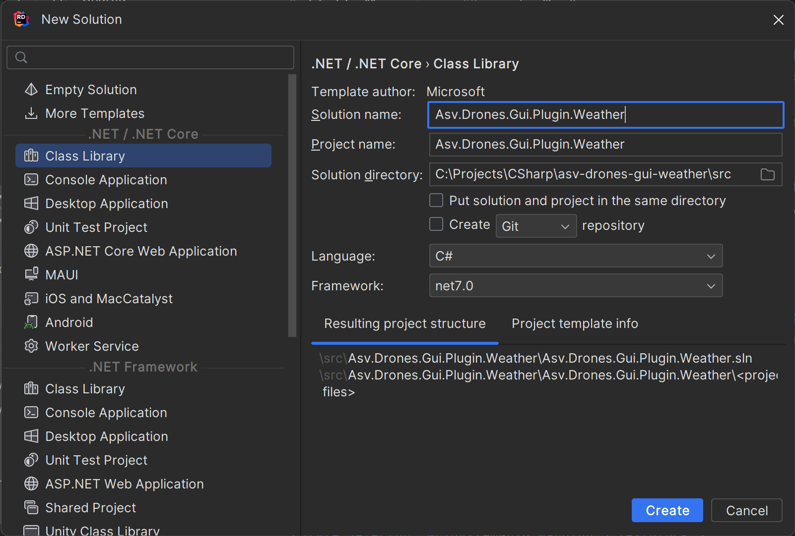

### Project Structure and Dependencies

Make sure your plugin project in a directory parallel to the main `ASV.Drones` project.


Ensure the addition of crucial dependencies such as:

* Resource files (RS.resx) - necessary for text localization.
* App.axaml file - helps in importing and exporting styles and custom controls.
* Asv.Drones.Gui.Custom.props file - used for managing the versions of required NuGet packages.

Below is the structure of `Asv.Drones.Gui.Custom.props` file. This describes all dependencies with main project. Specify an `<ApiVersion>` at your plugin project same 

```xml
<Project>
    <PropertyGroup>
        <ProductVersion>1.0.1</ProductVersion>
        <ApiVersion>1.0.1</ApiVersion>
        <ApiPrevVersion>1.0.0</ApiPrevVersion>
        <AvaloniaVersion>11.0.6</AvaloniaVersion>
        <AsvCommonVersion>2.0.2</AsvCommonVersion>
        <AsvAvaloniaToolkitVersion>1.0.1</AsvAvaloniaToolkitVersion>
        <AsvAvaloniaMapVersion>2.0.5</AsvAvaloniaMapVersion>
        <AsvMavlinkVersion>3.10.0</AsvMavlinkVersion>
        <FluentAvaloniaUIVersion>2.0.5</FluentAvaloniaUIVersion>
        <ReactiveUIVersion>19.5.41</ReactiveUIVersion>
        <SystemReactiveVersion>6.0.0</SystemReactiveVersion>
        <MaterialIconsAvaloniaVersion>2.0.1</MaterialIconsAvaloniaVersion>
        <ReactiveUIValidationVersion>3.1.7</ReactiveUIValidationVersion>
        <CompositionVersion>8.0.0</CompositionVersion>
    </PropertyGroup>
</Project>
```

After set up the properties, your plugin `Custom.props` file should look like this below.
```xml
<Project>
  <PropertyGroup>
    <Nullable>enable</Nullable>
    <ProductVersion>1.0.0</ProductVersion>
    <ApiVersion>1.0.1</ApiVersion>
    <ReactiveUIVersion>19.5.41</ReactiveUIVersion>
  </PropertyGroup>
</Project>
```

Finally, set up the `.csproj` file with `PackageReference` manually or via NuGet packages (recommend). Special warning to `<OutputPath>` attribute. It needs to way to the plugins folder of main project `Asv.Drones`

```xml
<Project Sdk="Microsoft.NET.Sdk">

    <PropertyGroup>
        <TargetFramework>net8.0</TargetFramework>
        <ImplicitUsings>enable</ImplicitUsings>
        <Nullable>enable</Nullable>
        <GeneratePackageOnBuild>true</GeneratePackageOnBuild>
        <AssemblyVersion>$(ProductVersion)</AssemblyVersion>
        <FileVersion>$(ProductVersion)</FileVersion>
        <Version>$(ProductVersion)</Version>
        <Title>Weather</Title>
        <Authors>https://github.com/asv-soft</Authors>
        <Description>Asv.Drones GUI application plugin to display and customize current weather using Windy and OpenWeatherMap providers.</Description>
        <Copyright>https://github.com/asv-soft</Copyright>
        <PackageProjectUrl>https://github.com/asv-soft/asv-drones-gui-plugin-weather</PackageProjectUrl>
        <PackageLicenseUrl>https://github.com/asv-soft/asv-drones-gui-plugin-weather?tab=MIT-1-ov-file#readme</PackageLicenseUrl>
        <RepositoryUrl>https://github.com/asv-soft/asv-drones-gui-plugin-weather</RepositoryUrl>
        <RepositoryType>git</RepositoryType>
    </PropertyGroup>

    <PropertyGroup Condition=" '$(Configuration)' == 'Debug' ">
        <OutputPath>..\..\..\asv-drones\src\Asv.Drones.Gui.Desktop\bin\Debug\net8.0\asv-data-folder\plugins\Asv.Drones.Gui.Plugin.Weather\</OutputPath>
    </PropertyGroup>

    <ItemGroup>
        <PackageReference Include="Asv.Drones.Gui.Api" Version="$(ApiVersion)" />
        <PackageReference Include="ReactiveUI.Fody" Version="$(ReactiveUIVersion)" />
    </ItemGroup>

    <ItemGroup>
        <EmbeddedResource Update="RS.resx">
            <Generator>PublicResXFileCodeGenerator</Generator>
            <LastGenOutput>RS.Designer.cs</LastGenOutput>
        </EmbeddedResource>
    </ItemGroup>

    <ItemGroup>
        <Compile Update="RS.Designer.cs">
            <DesignTime>True</DesignTime>
            <AutoGen>True</AutoGen>
            <DependentUpon>RS.resx</DependentUpon>
        </Compile>
    </ItemGroup>

</Project>
```

Now you can launch project, and make sure it displays in plugins list

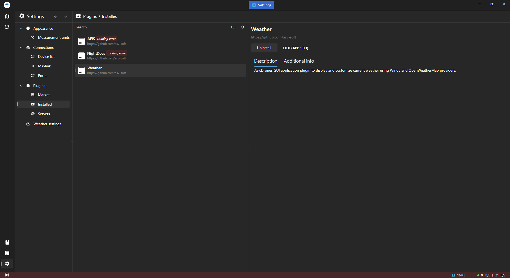

Once we've completed the initial steps, we can proceed further.

Our next task involves creating a class that will act as the entry point for our plugin. If we refer to the code provided earlier, we can see that this class is named "WeatherPlugin.cs".

Let's delve into the details of this class!

```csharp
using System.ComponentModel.Composition;
using Asv.Drones.Gui.Core;
using Avalonia;
using Avalonia.Markup.Xaml.Styling;
using Avalonia.Styling;

namespace Asv.Drones.Gui.Plugin.Weather;

[PluginEntryPoint("Weather", CorePlugin.Name)]
[PartCreationPolicy(CreationPolicy.Shared)]
public class WeatherPlugin : IPluginEntryPoint
{
    [ImportingConstructor]
    public WeatherPlugin()
    {
        
    }
    public void Initialize()
    {
        
    }

    public void OnFrameworkInitializationCompleted()
    {
        Application.Current.Styles.Add(new StyleInclude(new Uri("resm:Styles?assembly=Asv.Drones.Gui.Plugin.Weather"))
        {
            Source = new Uri("avares://Asv.Drones.Gui.Plugin.Weather/App.axaml")
        });
    }

    public void OnShutdownRequested()
    {
        
    }
}
```

The WeatherPlugin class implements the IPluginEntryPoint interface and the PluginEntryPoint attribute. This designates the WeatherPlugin class as a plugin entry point. The creation policy for the entry point is always shared.

The plugin project is organized into several folders:

* **Controls:** Contains all custom controls.
* **Service:** Provides all services.
* **Shell:** Includes all shell pages, view-models, and views.

This organization mirrors the structure of the Asv.Drones.Gui solution files. Let's explore the contents of these folders:

1.  **Controls:**

    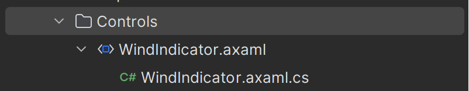

    The only file here is **WindIndicator**. This simple custom control adjusts to the given wind angle.
2.  **Service:**

    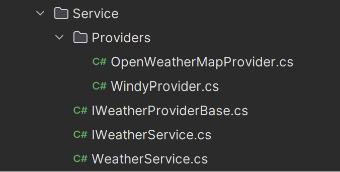

    This folder implements the weather service class and interface. The Providers folder currently houses two weather providers: Windy and OpenWeatherMap. The service is implemented here for the following reasons: to save and load the last weather data when the weather button is displayed, to download weather data from the selected provider, to save the last selected provider and its API key, and to control the visibility of the action button.
3.  **Shell:**

    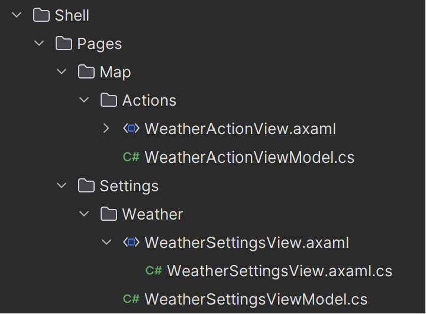

    There are two views and view-models for the weather. The first is used to add an **action button** to our flight page.

    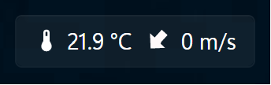

    The second is used to display the weather settings in the program settings list.

    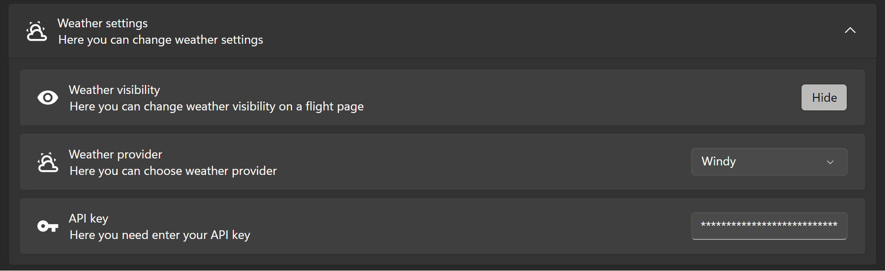

### Code Explanation

#### Weather Action Button

To better understand the action button's functionality, let's examine its view, code-behind, and view-model!

We'll start with the view:

```xaml
<UserControl xmlns="https://github.com/avaloniaui"
             xmlns:x="http://schemas.microsoft.com/winfx/2006/xaml"
             xmlns:d="http://schemas.microsoft.com/expression/blend/2008"
             xmlns:mc="http://schemas.openxmlformats.org/markup-compatibility/2006"
             xmlns:avalonia="clr-namespace:Material.Icons.Avalonia;assembly=Material.Icons.Avalonia"
             xmlns:weather="clr-namespace:Asv.Drones.Gui.Plugin.Weather"
             mc:Ignorable="d" d:DesignWidth="160" d:DesignHeight="40"
             x:Class="Asv.Drones.Gui.Plugin.Weather.WeatherActionView"
             x:DataType="weather:WeatherActionViewModel"
             IsVisible="{CompiledBinding Visibility}">
    <Design.DataContext>
        <weather:WeatherActionViewModel/>
    </Design.DataContext>
    <Button Command="{CompiledBinding UpdateWeather}" HorizontalAlignment="Center">
        <StackPanel Orientation="Horizontal" Spacing="5">
            <avalonia:MaterialIcon Kind="Temperature"/>
            <TextBlock VerticalAlignment="Center" Text="{CompiledBinding Temperature}"/>
            <weather:WindIndicator Width="20" Height="20" 
                                   Angle="{CompiledBinding WindDirection}" 
                                   Value="{CompiledBinding WindSpeed}"/>
            <TextBlock VerticalAlignment="Center" Text="{CompiledBinding WindSpeedString}"/>
        </StackPanel>
    </Button>
</UserControl>
```

* **Namespaces:** The script starts by defining namespaces. These help the XAML parser understand the meaning of the elements and attributes in your markup. Apart from the standard XAML namespaces, additional namespaces for AvaloniaUI, Material Icons for Avalonia, and the specific Weather plugin are also included.
* **UserControl:** This primary object represented by the top-level UserControl element is the primary object that this XAML defines. UserControl serves as a base class for creating custom, reusable controls.
  * The `x:Class` attribute specifies the code-behind class for this XAML file. Here, the value is `Asv.Drones.Gui.Plugin.Weather.WeatherActionView`.
  * The `x:DataType` attribute indicates the ViewModel that this View binds to, which in this case is `Asv.Drones.Gui.Plugin.Weather.WeatherActionViewModel`.
  * The `IsVisible` attribute binds to the `Visibility` property of `WeatherActionViewModel` and determines the visibility of the UserControl.
* **Design DataContext:** This attribute sets the design-time data context to an instance of `WeatherActionViewModel`. It's primarily used for design-time data binding in visual design tools.
* **Button:** This element establishes a button that triggers the `UpdateWeather` command from the ViewModel upon clicking. The button includes a StackPanel, which aligns several child elements horizontally.
* **StackPanel:** The `StackPanel` has its `Orientation` set to `Horizontal`, aligning its child elements horizontally. It contains an Icon, two TextBlock elements presenting the `Temperature` and `WindSpeed` strings, and a custom `WindIndicator` control.
* **Elements in StackPanel:** The `MaterialIcon`, `TextBlock`, and `WindIndicator` elements inside the `StackPanel` are databound to properties in `WeatherActionViewModel` such as Temperature, WindDirection, and WindSpeed.

Next, let's examine the code-behind of the view:

```csharp
using System.ComponentModel.Composition;
using Asv.Drones.Gui.Core;
using Avalonia.Markup.Xaml;
using Avalonia.ReactiveUI;

namespace Asv.Drones.Gui.Plugin.Weather;

[ExportView(typeof(WeatherActionViewModel))]
[PartCreationPolicy(CreationPolicy.NonShared)]
public partial class WeatherActionView : ReactiveUserControl<WeatherActionViewModel>
{
    public WeatherActionView()
    {
        InitializeComponent();
    }

    private void InitializeComponent()
    {
        AvaloniaXamlLoader.Load(this);
    }
}
```

* **Namespaces:**
  * `System.ComponentModel.Composition` is a namespace that comprises types used for creating extensible applications in the Managed Extensibility Framework (MEF).
  * `Asv.Drones.Gui.Core`, `Avalonia.Markup.Xaml`, and `Avalonia.ReactiveUI` are specific to the libraries utilized the application.
* **Annotations:**
  * The `[ExportView(typeof(WeatherActionViewModel))]` attribute signifies that this class offers an exported view for the WeatherActionViewModel, which is used for dependency injection. It's a specific attribute of the `Asv.Drones.Gui.Core` library.
  * `[PartCreationPolicy(CreationPolicy.NonShared)]` attribute, part of MEF, denotes that a new instance of `WeatherActionView` is initiated each time it's required.
* **Class Declaration:**
  * The `WeatherActionView` class inherits from `ReactiveUserControl<WeatherActionViewModel>`, a class from the ReactiveUI library that supports a reactive programming model. `WeatherActionViewModel` is the view model that this view binds to.
* **Methods:**
  * In the constructor (`public WeatherActionView()`), the `InitializeComponent()` method is called. This method uses `AvaloniaXamlLoader.Load(this)` to load the relevant Avalonia XAML for the current control.

Next, let's dive into the view-model:

```csharp
using System.ComponentModel.Composition;
using System.Windows.Input;
using Asv.Common;
using Asv.Drones.Gui.Core;
using Avalonia;
using Avalonia.Controls;
using Avalonia.Markup.Xaml.Styling;
using DynamicData.Binding;
using ReactiveUI;
using ReactiveUI.Fody.Helpers;

namespace Asv.Drones.Gui.Plugin.Weather;

[Export(FlightPageViewModel.UriString,typeof(IMapAction))]
[PartCreationPolicy(CreationPolicy.NonShared)]
public class WeatherActionViewModel : MapActionBase
{
    private readonly IWeatherService _weatherService;
    private readonly ILocalizationService _localizationService;

    public WeatherActionViewModel() : base("asv:shell.page.map.action.weather")
    {
        if (Design.IsDesignMode)
        {
            Application.Current.Styles.Add(new StyleInclude(new Uri("resm:Styles?assembly=Asv.Drones.Gui.Plugin.Weather"))
            {
                Source = new Uri("avares://Asv.Drones.Gui.Plugin.Weather/App.axaml")
            });
            
            Visibility = true;
            
            CurrentWeatherData = new WeatherData
            {
                WindSpeed = 8,
                WindDirection = 123,
                Temperature = 22.25
            };

            WindDirection = CurrentWeatherData.WindDirection;
            WindSpeedString = $"{CurrentWeatherData.WindSpeed} m/s";
            Temperature = $"{CurrentWeatherData.Temperature} K";
        }
    }
    
    [ImportingConstructor]
    public WeatherActionViewModel(IWeatherService weatherService, ILocalizationService localizationService) : this()
    {
        _weatherService = weatherService;
        _localizationService = localizationService;

        _weatherService.LastWeatherData
            .Subscribe(_ => CurrentWeatherData = _)
            .DisposeItWith(Disposable);
        
        _weatherService.Visibility
            .Subscribe(_ => Visibility = _)
            .DisposeItWith(Disposable);
    }
    
    public ICommand UpdateWeather { get; set; }
    
    [Reactive]
    public WeatherData CurrentWeatherData { get; set; }
    
    [Reactive]
    public string WindSpeedString { get; set; }
    
    [Reactive]
    public double WindSpeed { get; set; }

    [Reactive]
    public double WindDirection { get; set; }
    
    [Reactive]
    public string Temperature { get; set; }

    [Reactive]
    public bool Visibility { get; set; }
    
    public async Task UpdateWeatherImpl(GeoPoint location)
    {
        CurrentWeatherData = await _weatherService.GetWeatherData(location);
    }

    
    public override IMapAction Init(IMap context)
    {
        base.Init(context);
        UpdateWeather = ReactiveCommand.CreateFromTask(
            () => UpdateWeatherImpl(context.Center)).DisposeItWith(Disposable);
        
        this.WhenPropertyChanged(_ => _.CurrentWeatherData)
            .Subscribe(_ =>
            {
                if (CurrentWeatherData != null)
                {
                    WindDirection = CurrentWeatherData.WindDirection;
                    WindSpeed = CurrentWeatherData.WindSpeed;
                    WindSpeedString = _localizationService.Velocity.FromSiToStringWithUnits(CurrentWeatherData.WindSpeed);
                    Temperature = _localizationService.Temperature.FromSiToStringWithUnits(CurrentWeatherData.Temperature);

                    _weatherService.LastWeatherData.OnNext(CurrentWeatherData);
                }
            })
            .DisposeItWith(Disposable);
        
        return this;
    }
}
```

* **Dependencies:**
  * The class employs MEF (Managed Extensibility Framework) as a form of dependency injection, as indicated by the Export and ImportingConstructor attributes. The dependencies in this class include `IWeatherService` and `ILocalizationService`.
* **Design Mode Behavior:**
  * The default constructor features a block of code that executes conditionally when the application operates in Design Mode, which is usually when it is being edited in a UI designer of an IDE. This block applies specific styling to the application and sets some default values.
* **ViewModel Properties:**
  * The ViewModel exposes several properties:
    * `UpdateWeather` is a command bound to a UI action (likely a button click event) that invokes the `UpdateWeatherImpl` method.
    * `CurrentWeatherData`, `WindSpeedString`, `WindSpeed`, `WindDirection`, `Temperature`, and `Visibility` are all Reactively bound properties. The ReactiveUI framework is used here for declarative UI updates. The `[Reactive]` attribute instructs ReactiveUI to raise PropertyChanged events whenever the value of these properties changes.
* **Initialization:**
  * The `Init` method establishes the command, the map center, and subscribes to the `CurrentWeatherData` property's changes. Accordingly, it updates the UI (Wind direction, Wind speed, Temperature, and triggers the `LastWeatherData` event) whenever `CurrentWeatherData` changes. Upon initializing it, the method returns an instance of the class.

#### Weather Settings

Here's the view:

```xaml
<UserControl xmlns="https://github.com/avaloniaui"
             xmlns:x="http://schemas.microsoft.com/winfx/2006/xaml"
             xmlns:d="http://schemas.microsoft.com/expression/blend/2008"
             xmlns:mc="http://schemas.openxmlformats.org/markup-compatibility/2006"
             xmlns:weather="clr-namespace:Asv.Drones.Gui.Plugin.Weather"
             xmlns:core="clr-namespace:Asv.Drones.Gui.Core;assembly=Asv.Drones.Gui.Core"
             mc:Ignorable="d" d:DesignWidth="800" d:DesignHeight="450"
             x:Class="Asv.Drones.Gui.Plugin.Weather.WeatherSettingsView"
             x:CompileBindings="True"
             x:DataType="weather:WeatherSettingsViewModel">
    <Design.DataContext>
        <weather:WeatherSettingsViewModel/>
    </Design.DataContext>
    <core:OptionsDisplayItem Header="{x:Static weather:RS.WeatherSettingsView_Header}"
                             Icon="{Binding WeatherIcon}"
                             Description="{x:Static weather:RS.WeatherSettingsView_Description}"
                             Expands="True"
                             IsExpanded="False">
        <core:OptionsDisplayItem.Content>
            <StackPanel Spacing="8">
                <core:OptionsDisplayItem Header="{x:Static weather:RS.WeatherSettingsView_WeatherSwitch_Header}" 
                                         Icon="{Binding WeatherSwitchIcon}"
                                         Description="{x:Static weather:RS.WeatherSettingsView_WeatherSwitch_Description}">
                    <core:OptionsDisplayItem.ActionButton>
                        <ToggleButton Content="{CompiledBinding VisibilityButton}" IsChecked="{CompiledBinding Visibility}"/>
                    </core:OptionsDisplayItem.ActionButton>
                </core:OptionsDisplayItem>
                <core:OptionsDisplayItem Header="{x:Static weather:RS.WeatherSettingsView_WeatherProvider_Header}"
                                         Icon="{Binding WeatherIcon}"
                                         Description="{x:Static weather:RS.WeatherSettingsView_WeatherProvider_Description}">
                    <core:OptionsDisplayItem.ActionButton>
                        <ComboBox Width="180" ItemsSource="{CompiledBinding WeatherProviders}" 
                                  SelectedItem="{CompiledBinding CurrentWeatherProvider}">
                            <ComboBox.ItemTemplate>
                                <DataTemplate>
                                    <TextBlock Text="{CompiledBinding Name}"/>
                                </DataTemplate>
                            </ComboBox.ItemTemplate>
                        </ComboBox>   
                    </core:OptionsDisplayItem.ActionButton>
                </core:OptionsDisplayItem>
                <core:OptionsDisplayItem Header="{x:Static weather:RS.WeatherSettingsView_WeatherApiKey_Header}"
                                         Icon="{Binding WeatherApiKeyIcon}"
                                         Description="{x:Static weather:RS.WeatherSettingsView_WeatherApiKey_Description}">
                    <core:OptionsDisplayItem.ActionButton>
                        <TextBox Watermark="Enter your api key" Width="180" Text="{CompiledBinding CurrentWeatherProviderApiKey}"/>
                    </core:OptionsDisplayItem.ActionButton>
                </core:OptionsDisplayItem>
            </StackPanel>
        </core:OptionsDisplayItem.Content>
    </core:OptionsDisplayItem>
</UserControl>
```

1. The highest level describes a `UserControl`, which is a custom, reusable control composed of other controls.
2. The namespaces declared at the top map XML namespaces to CLR (Common Language Runtime) namespaces. This mapping allows the XML markup to use types in the corresponding CLR namespaces.
3. The `x:Class` attribute specifies the CLR namespace and class name for the code-behind class of the XAML file.
4. `x:DataType` represents the type of object to be used for data binding in this view. Here, it represents a ViewModel type from the weather CLR namespace.
5. The `Design.DataContext` element assigns a design-time DataContext, which is the ViewModel instance the IDE's designer uses to render the XAML at design-time.
6. `core:OptionsDisplayItem` is a custom control used in the application. Various properties, such as `Header`, `Icon`, `Description`, `Expands`, and `IsExpanded`, are set.
7. Within the `OptionsDisplayItem`, a `StackPanel` allows for the arrangement of multiple `core:OptionsDisplayItem` elements in a stack, either horizontally or vertically. A vertical arrangement is utilized here (which is the default).
8. Inside each `core:OptionsDisplayItem`, there are `ToggleButton`, `ComboBox`, and `TextBox` controls used for different functionalities such as toggling visibility, selecting from multiple options, and entering text, respectively.
9. `{CompiledBinding}` is a markup extension that recommends a binding to be compiled for improved performance.
10. `{x:Static}` refers to a static property. For instance, `{x:Static weather:RS.WeatherSettingsView_Header}` refers to the static `WeatherSettingsView_Header` property on the `RS` class in the `weather` namespace.
11. The `ComboBox.ItemTemplate` property defines a `DataTemplate` that describes how data objects should be displayed. In this case, the `TextBlock` element is employed to display the `Name` property.

Next, let's explore the code-behind:

```csharp
using System.ComponentModel.Composition;
using Asv.Drones.Gui.Core;
using Avalonia;
using Avalonia.Controls;
using Avalonia.Markup.Xaml;
using Avalonia.ReactiveUI;

namespace Asv.Drones.Gui.Plugin.Weather;

[ExportView(typeof(WeatherSettingsViewModel))]
[PartCreationPolicy(CreationPolicy.NonShared)]
public partial class WeatherSettingsView : ReactiveUserControl<WeatherSettingsViewModel>
{
    public WeatherSettingsView()
    {
        InitializeComponent();
    }
    
    private void InitializeComponent()
    {
        AvaloniaXamlLoader.Load(this);
    }
}
```

* The `using` statements at the top import required references.
* The namespace `Asv.Drones.Gui.Plugin.Weather` contains this class. Namespaces help organize your code.
* The `[ExportView(typeof(WeatherSettingsViewModel))]` attribute marks this class for export via MEF (Managed Extensibility Framework). In this context, it's paired with a ViewModel type `WeatherSettingsViewModel` through the `ExportView` attribute. The framework will then inject instances of this view when necessary within your application.
* The `[PartCreationPolicy(CreationPolicy.NonShared)]` attribute indicates that new instances of this class should be created every time the class needs to be injected or consumed within the program. The `CreationPolicy.NonShared` specifies that MEF will not cache and reuse the instances of this part. Instead, it will always create a new instance of `WeatherSettingsView` whenever it is requested.
* `ReactiveUserControl<WeatherSettingsViewModel>` is the base class that `WeatherSettingsView` inherits from. Avalonia.ReactiveUI leverages a specific UI programming paradigm inspired by functional reactive programming. In this situation, `WeatherSettingsViewModel` is the associated ViewModel type.
* The `InitializeComponent` method is where the Avalonia UI gets loaded via the `AvaloniaXamlLoader.Load(this)` line. The layout, controls, and styles for this component are expected to be defined in the corresponding XAML file.

Lastly, let's consider the shell's ViewModel:

```csharp
using System;
using System.Collections.Generic;
using System.ComponentModel.Composition;
using Asv.Common;
using Asv.Drones.Gui.Core;
using DynamicData.Binding;
using Material.Icons;
using ReactiveUI;
using ReactiveUI.Fody.Helpers;

namespace Asv.Drones.Gui.Plugin.Weather;

[Export(typeof(ISettingsPart))]
[PartCreationPolicy(CreationPolicy.NonShared)]
public class WeatherSettingsViewModel : SettingsPartBase
{
    private static readonly Uri Uri = new(SettingsPartBase.Uri, "weather");
    private readonly IWeatherService _weatherService;

    public WeatherSettingsViewModel() : base(Uri)
    {
        
    }

    [ImportingConstructor]
    public WeatherSettingsViewModel(IWeatherService weatherService) : this()
    {
        _weatherService = weatherService;
        
        _weatherService.Visibility.Subscribe(_ => Visibility = _).DisposeItWith(Disposable);
        
        this.WhenAnyValue(_ => _.Visibility)
            .Subscribe(_weatherService.Visibility)
            .DisposeItWith(Disposable);
        
        this.WhenValueChanged(_ => _.Visibility)
            .Subscribe(_ =>
            {
                VisibilityButton = _
                    ? RS.WeatherSettingsView_WeatherSwitch_Button_Hide
                    : RS.WeatherSettingsView_WeatherSwitch_Button_Show;
            })
            .DisposeItWith(Disposable);
        
        _weatherService.CurrentWeatherProvider.Subscribe(_ => CurrentWeatherProvider = _).DisposeItWith(Disposable);
        
        this.WhenAnyValue(_ => _.CurrentWeatherProvider)
            .Subscribe(_weatherService.CurrentWeatherProvider)
            .DisposeItWith(Disposable);
        
        _weatherService.CurrentWeatherProviderApiKey.Subscribe(_ => CurrentWeatherProviderApiKey = _).DisposeItWith(Disposable);
        
        this.WhenAnyValue(_ => _.CurrentWeatherProviderApiKey)
            .Subscribe(_weatherService.CurrentWeatherProviderApiKey)
            .DisposeItWith(Disposable);
    }

    public override int Order => 4;
    
    [Reactive]
    public bool Visibility { get; set; }

    [Reactive]
    public string VisibilityButton { get; set; }
    
    [Reactive]
    public IWeatherProviderBase CurrentWeatherProvider { get; set; }
    
    [Reactive]
    public string CurrentWeatherProviderApiKey { get; set; }

    public IEnumerable<IWeatherProviderBase> WeatherProviders => _weatherService.WeatherProviders;
    public string WeatherIcon => MaterialIconDataProvider.GetData(MaterialIconKind.WeatherPartlyCloudy);
    public string WeatherApiKeyIcon => MaterialIconDataProvider.GetData(MaterialIconKind.Key);
    public string WeatherSwitchIcon => MaterialIconDataProvider.GetData(MaterialIconKind.Visibility);
}
```

The `WeatherSettingsViewModel` class extends from `SettingsPartBase` and implements the `ISettingsPart` interface, serving as a ViewModel in an MVVM (Model-View-ViewModel) pattern. It's tasked with defining and managing the state and the operations related to the application's weather settings.

Here are several key points:

1. **MEF and Dependency Injection:** The class employs the Managed Extensibility Framework (MEF), evident from the `Export` and `ImportingConstructor` attributes, as a form of Dependency Injection.
2. **IWeatherService:** This interface delivers methods and properties related to the app's weather functionality. The `WeatherSettingsViewModel` interacts with this service to manipulate and present data.
3. **ReactiveUI and Reactive Properties:** The class uses ReactiveUI, an MVVM framework, for reactive programming to streamline state management. The `[Reactive]` attribute is applied to define properties (`Visibility`, `VisibilityButton`, `CurrentWeatherProvider`, and `CurrentWeatherProviderApiKey`) that will automatically notify the UI of any changes.
4. **Subscriptions:** They enable the ViewModel to subscribe to changes in certain properties and execute corresponding actions. For example, one subscription responds to changes in the `Visibility` property and adjusts the text of `VisibilityButton` accordingly.
5. **Properties:** `WeatherProviders` returns available weather providers, and `WeatherIcon`, `WeatherApiKeyIcon`, and `WeatherSwitchIcon` methods fetch data to display specific icons in the UI.
6. Overall, this class acts as a bridge between the view and the model, manipulating data given by `IWeatherService` and presenting it to the UI in an engaging manner. Changes in the reactive properties will reflect in the UI, offering real-time interactivity.

#### Weather service class and interface

**Interface**

```csharp
using System.Collections.Generic;
using System.Threading.Tasks;
using Asv.Common;

namespace Asv.Drones.Gui.Plugin.Weather;

public interface IWeatherService
{
    public IRxEditableValue<bool> Visibility { get; }
    public IEnumerable<IWeatherProviderBase> WeatherProviders { get; }
    public IRxEditableValue<string> CurrentWeatherProviderApiKey { get; }
    public IRxEditableValue<IWeatherProviderBase> CurrentWeatherProvider { get; }

    public IRxEditableValue<WeatherData> LastWeatherData { get; }
    public Task<WeatherData> GetWeatherData(GeoPoint location);
}
```

**Class**

```csharp
using System;
using System.Collections.Generic;
using System.ComponentModel.Composition;
using System.Linq;
using System.Threading.Tasks;
using Asv.Cfg;
using Asv.Common;
using Asv.Drones.Gui.Core;

namespace Asv.Drones.Gui.Plugin.Weather;

public class WeatherServiceConfig
{
    public bool Visibility { get; set; }
    public string CurrentProviderName { get; set; }
    public Dictionary<string, string> ProvidersApiKeys { get; set; } = new();
    
    public WeatherData LastWeatherData { get; set; }
}

[Export(typeof(IWeatherService))]
[PartCreationPolicy(CreationPolicy.Shared)]
public class WeatherService : ServiceWithConfigBase<WeatherServiceConfig>, IWeatherService
{
    private readonly IEnumerable<IWeatherProviderBase> _weatherProviders;

    [ImportingConstructor]
    public WeatherService(IConfiguration cfg, [ImportMany] IEnumerable<IWeatherProviderBase> weatherProviders) : base(cfg)
    {
        if (cfg == null) throw new ArgumentNullException(nameof(cfg));
        
        var visibilityFromConfig = InternalGetConfig(_ => _.Visibility);
        
        Visibility = new RxValue<bool>(visibilityFromConfig).DisposeItWith(Disposable);
        
        Visibility.Subscribe(SetVisibility).DisposeItWith(Disposable);
        
        var weatherProviderFromConfig = InternalGetConfig(_ => _.CurrentProviderName);

        if (weatherProviderFromConfig.IsNullOrWhiteSpace())
        {
            CurrentWeatherProvider = new RxValue<IWeatherProviderBase>(
                    weatherProviders.FirstOrDefault())
                .DisposeItWith(Disposable);
        }
        else
        {
            CurrentWeatherProvider = new RxValue<IWeatherProviderBase>(
                    weatherProviders.SingleOrDefault(_ => _.Name == weatherProviderFromConfig))
                .DisposeItWith(Disposable);
        }
        
        CurrentWeatherProvider.Subscribe(SetCurrentProvider).DisposeItWith(Disposable);
        
        var weatherProviderApiKeyFromConfig = 
            InternalGetConfig(_ =>
            {
                if (_.ProvidersApiKeys == null) _.ProvidersApiKeys = new();
                if (_.ProvidersApiKeys.TryGetValue(CurrentWeatherProvider.Value.Name, out var __))
                {
                    return __;
                }
                return "";
            });

        CurrentWeatherProviderApiKey = new RxValue<string>(weatherProviderApiKeyFromConfig)
            .DisposeItWith(Disposable);
        
        CurrentWeatherProviderApiKey.Subscribe(SetCurrentProviderApiKey).DisposeItWith(Disposable);
        
        var lastWeatherDataFromConfig = InternalGetConfig(_ => _.LastWeatherData);
        
        LastWeatherData = new RxValue<WeatherData>(lastWeatherDataFromConfig ?? new WeatherData()).DisposeItWith(Disposable);
        
        LastWeatherData.Subscribe(SetLastWeatherData).DisposeItWith(Disposable);
        
        _weatherProviders = weatherProviders;
    }
    
    public IRxEditableValue<bool> Visibility { get; }

    public IRxEditableValue<WeatherData> LastWeatherData { get; }
    
    public IRxEditableValue<IWeatherProviderBase> CurrentWeatherProvider { get; }

    public IRxEditableValue<string> CurrentWeatherProviderApiKey { get; }
    
    public IEnumerable<IWeatherProviderBase> WeatherProviders => _weatherProviders;
    
    private void SetVisibility(bool visibility)
    {
        InternalSaveConfig(_ => _.Visibility = visibility);
    }

    private async void SetCurrentProvider(IWeatherProviderBase provider)
    {
        if (CurrentWeatherProviderApiKey != null)
        {
            var apiKey = InternalGetConfig(_ =>
            {
                if (_.ProvidersApiKeys == null) 
                    _.ProvidersApiKeys = new();
                
                if (_.ProvidersApiKeys.TryGetValue(provider.Name, out var __))
                {
                    return __;
                }
                return "";
            });
            
            CurrentWeatherProviderApiKey.OnNext(apiKey);

            CurrentWeatherProvider.Value.ApiKey = apiKey;
        }
        
        InternalSaveConfig(_ => _.CurrentProviderName = provider.Name);
    }

    private void SetCurrentProviderApiKey(string key)
    {
        CurrentWeatherProvider.Value.ApiKey = key;
        
        InternalSaveConfig(_ => 
            _.ProvidersApiKeys[CurrentWeatherProvider.Value.Name] = key);
    }
    
    private void SetLastWeatherData(WeatherData data)
    {
        InternalSaveConfig(_ =>_.LastWeatherData = data);
    }
    
    public async Task<WeatherData> GetWeatherData(GeoPoint location)
    {
        return await CurrentWeatherProvider.Value.GetWeatherData(location);
    }
}
```

The `WeatherService` class employs the MEF (Managed Extensibility Framework) for plugin management, as indicated by the `Export` and `ImportingConstructor` attributes. The MEF facilitates loose coupling between the main application and its extensions or plugins.

The `WeatherServiceConfig` class outlines the configuration for the `WeatherService`, such as the visibility setting, the current weather provider, the last weather data, and a dictionary for storing API keys of various weather providers.

Within the `WeatherService` class:

* The class inherits `ServiceWithConfigBase<WeatherServiceConfig>`, using a configuration of the `WeatherServiceConfig` type.
* It contains an instance of `IEnumerable<IWeatherProviderBase>`, representing multiple weather data providers.
* Its constructor imports the configuration and the list of weather providers. The configuration is used to access and adjust properties like visibility, current weather provider, API key, and the last weather data.
* The `IRxEditableValue<T>` instances denote reactive properties. Any change in these properties triggers a defined action. For instance, a modification in the `Visibility` property triggers the `SetVisibility` method.
* Every time there's a shift in a reactive property, the corresponding method (like `SetVisibility`, `SetCurrentProvider`, `SetCurrentProviderApiKey`, `SetLastWeatherData`) is invoked, which in turn updates the configuration accordingly.
* The `GetWeatherData(GeoPoint location)` method fetches weather data for a specific location.

#### WeatherData and IWeatherProviderBase

```csharp
using System.Threading.Tasks;
using Asv.Common;

namespace Asv.Drones.Gui.Plugin.Weather;

public class WeatherData
{
    public double WindSpeed { get; set; }
    public double WindDirection { get; set; }
    public double Temperature { get; set; }
}

public interface IWeatherProviderBase
{
    string ApiKey { get; set; }
    string Name { get; }

    Task<WeatherData> GetWeatherData(GeoPoint location);
    Task<WeatherData> GetWeatherData(double latitude, double longitude);
}
```

The class at the top, `WeatherData`, includes three properties: `WindSpeed`, `WindDirection`, and `Temperature`. Each of these properties is of the `double` type. Presumably, this class is intended to store weather-related data.

The `IWeatherProviderBase` interface is declared at the bottom. It outlines a property `ApiKey`, a read-only property `Name`, and two `GetWeatherData` methods. The `ApiKey` is presumably used for authenticating with the weather data provider's API, while `Name` likely represents the name of the weather provider.

The first `GetWeatherData` method takes a `GeoPoint` object as a parameter, whereas the second `GetWeatherData` method takes two `double` parameters for latitude and longitude. Both methods return a `Task<WeatherData>`, suggesting these are asynchronous methods that fetch `WeatherData` from a source, and are expected to be used with the `async/await` structure.

One note to make is that the `GeoPoint` type is not defined in this code snippet; it appears to be part of the `Asv.Common` namespace.

Any class intending to provide weather data would implement this interface, permitting different providers to be easily swapped out without the rest of the codebase needing to know where the data comes from. By using an interface, concrete implementations can have distinct behaviors yet still conform to a contract defined by the interface, thus promoting code reusability and modularity.

### Another example

**Asv.Drones.Gui.Plugin.FlightDocs** stands as another example of an open-source plugin implementation for the Asv.Drones.Gui project.

This illustrative plugin serves as a showcase, offering insights into the intricate art of extending the capabilities of the parent application. Its primary aim is to familiarize users with the fundamental intricacies of crafting their very own plugins and the vast potential they hold.

In this instructive endeavor, you will discover how to empower your interface with action buttons under the "Actions" banner on the map page, create custom widgets and even design custom control elements that align with your unique vision. Furthermore, it delves into the key elements of constructing services and the pivotal role providers play in these service-oriented extensions.

The project's file structure, meticulously crafted to emulate that of the primary `Asv.Drones.Gui` project, is not a mere coincidence. Rather, it is a deliberate choice, as this structured approach proves most advantageous for the development and upkeep of open-source plugins meant to enrich the functionality of the core application.

### How to build

Make sure the next components are installed:

* .NET SDK 8 - https://dotnet.microsoft.com/en-us/download/dotnet/8.0
* AvaloniaUI Templates - https://docs.avaloniaui.net/docs/get-started/install
* Avalonia XAML development - https://docs.avaloniaui.net/docs/get-started/set-up-an-editor

After you installed all of these, you need to follow the steps:

1. Open terminal and clone this repository using `git clone git@github.com:asv-soft/asv-drones-gui-flight-docs.git` command (URL may be different);
2. Open the cloned repository folder using `cd asv-drones-gui-flight-docs`;
3. Execute `git submodule init` command to initialize Asv.Drones.Gui as a submodule;
4. Execute `git submodule update` to set latest version on Asv.Drones.Gui submodule;
5. Then you need to restore NuGet packages in a plugin project with `dotnet restore`, `nuget restore` or through IDE;
6. Finally - try to build your project with `dotnet build` or through IDE.

### How to use

After building the source code of the plugin project, the final library should be placed in the directory of the already built `Asv.Drones.Gui` application, the next time you launch the application CompositionContainer will see the library and add it to the common list of libraries loaded at startup.

## Plugin development guide

### Introduction

This guide will walk you through the process of developing plugins for the `Asv.Drones.Gui` project. We'll use `Asv.Drones.Gui.Plugin.FlightDocs` as an example as it's a simple project mainly geared towards educational purposes.

### Project Naming

Once you've decided on a project name, follow the plugin naming rule. The main application (`Asv.Drones.Gui`) uses a composition container to load external libraries, which implies that your plugins should be implemented as libraries. Moreover, your library files should follow the naming format `Asv.Drones.Gui.Plugin.**YourPluginName**`. In our case, it will be `Asv.Drones.Gui.Plugin.FlightDocs`. This naming convention is crucial for the composition container to recognize and incorporate your plugin during the program start.

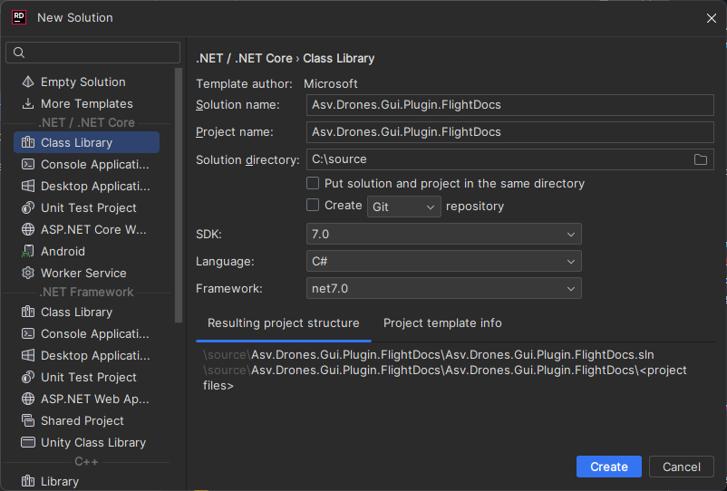

### Project Structure and Dependencies

The structure of your files and folders should mirror that of Asv.Drones.Gui. The final project structure is depicted below.

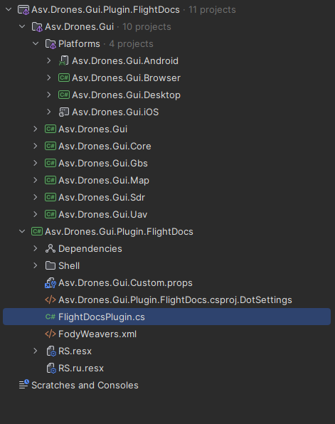

You can see that `Asv.Drones.Gui` project is present in our plugin solution. You need to add it as a Git submodule into your solution root folder as displayed in the image below.

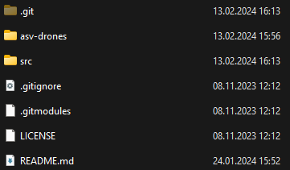

Next, manually add all the existing projects from `Asv.Drones.Gui`.

Ensure the addition of crucial dependencies such as:

* Resource files (RS.resx) - necessary for text localization.
* App.axaml file - helps in importing and exporting styles and custom controls.
* Asv.Drones.Gui.Custom.props file - used for managing the versions of required NuGet packages.

Below is the structure of `Asv.Drones.Gui.Custom.props` file. Copy this structure as it mentions the versions of all critical NuGet packages.

```xml
<Project>
    <PropertyGroup>
        <ProductVersion>1.0.1</ProductVersion>
        <ApiVersion>1.0.1</ApiVersion>
        <ApiPrevVersion>1.0.0</ApiPrevVersion>
        <AvaloniaVersion>11.0.6</AvaloniaVersion>
        <AsvCommonVersion>2.0.2</AsvCommonVersion>
        <AsvAvaloniaToolkitVersion>1.0.1</AsvAvaloniaToolkitVersion>
        <AsvAvaloniaMapVersion>2.0.5</AsvAvaloniaMapVersion>
        <AsvMavlinkVersion>3.10.0</AsvMavlinkVersion>
        <FluentAvaloniaUIVersion>2.0.5</FluentAvaloniaUIVersion>
        <ReactiveUIVersion>19.5.41</ReactiveUIVersion>
        <SystemReactiveVersion>6.0.0</SystemReactiveVersion>
        <MaterialIconsAvaloniaVersion>2.0.1</MaterialIconsAvaloniaVersion>
        <ReactiveUIValidationVersion>3.1.7</ReactiveUIValidationVersion>
        <CompositionVersion>8.0.0</CompositionVersion>
    </PropertyGroup>
</Project>
```

And you must do the same thing into FlightDocs project file.

```xml
<Project>
  <ItemGroup>
    <ProjectReference Condition="'$(ProjectName)' == 'Asv.Drones.Gui'" Include="$(SolutionDir)Asv.Drones.Gui.Plugin.FlightDocs\Asv.Drones.Gui.Plugin.FlightDocs.csproj" >
      <Private>false</Private>
      <ExcludeAssets>runtime</ExcludeAssets>
    </ProjectReference>
  </ItemGroup>
  <PropertyGroup>
    <Nullable>enable</Nullable>
    <PluginVersion>0.1.0</PluginVersion>
    <AvaloniaVersion>11.0.5</AvaloniaVersion>
    <AsvCommonVersion>1.13.1</AsvCommonVersion>
    <AsvMavlinkVersion>3.6.0-alpha12</AsvMavlinkVersion>
    <FluentAvaloniaUIVersion>2.0.0</FluentAvaloniaUIVersion>
    <ReactiveUIVersion>19.3.3</ReactiveUIVersion>
    <MaterialIconsAvaloniaVersion>2.0.1</MaterialIconsAvaloniaVersion>
    <ReactiveUIValidationVersion>3.1.7</ReactiveUIValidationVersion>
    <CompositionVersion>7.0.0</CompositionVersion>
    <NLogVersion>5.2.6</NLogVersion>
  </PropertyGroup>
</Project>
```

Once we've completed the initial steps, we can proceed further.

Our next task involves creating a class that will act as the entry point for our plugin. If we refer to the code provided earlier, we can see that this class is named "FlightDocsPlugin.cs".

Let's delve into the details of this class!

```csharp
using System.ComponentModel.Composition;
using Asv.Drones.Gui.Core;

namespace Asv.Drones.Gui.Plugin.FlightDocs;

[PluginEntryPoint("FlightDocs", CorePlugin.Name)]
[PartCreationPolicy(CreationPolicy.NonShared)]
public class FlightDocsPlugin : IPluginEntryPoint
{
    [ImportingConstructor]
    public FlightDocsPlugin()
    {
    }
    public void Initialize()
    {
    }

    public void OnFrameworkInitializationCompleted()
    {
    }

    public void OnShutdownRequested()
    {
    }
}
```

The FlightDocsPlugin class implements the IPluginEntryPoint interface and the PluginEntryPoint attribute. This designates the FlightDocsPlugin class as a plugin entry point. The creation policy for the entry point is always shared.

The plugin project has Map folder, which contains several more folders:

* **Actions:** Contains all actions that can be perfomed within plugin.
* **Anchors:** Contains all anchors used to mark points on a map.
* **Widgets:** Includes all widgets and dialogs used by plugin.

This organization mirrors the structure of the Asv.Drones.Gui solution files. Let's explore the contents of these folders:

1.  **Actions:**

    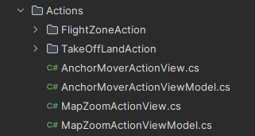

    This folder contains classes that implement several actions that can be perfomed while using this plugin. **FlightZoneAction** allows user to add points that represent the flight zone, **TakeOffLandAction** allows user to specify points where take off and landing will occure, **AnchorMoverAction** allows user to enable anchor editing mode where he can move anchors on map with drag-and-drop and **MapZoomAction** allows user to change map zoom.
2.  **Anchors:**

    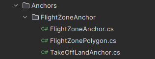

    This folder contains classes that implement anchors used in this plugin. **FlightZoneAnchor** is used to display flight zone points, **FlightZonePolygon** is used to draw a poligon that connects all flight zone points and **TakeOffLandAnchor** is used to display take off and land points.
3.  **Widgets:**

    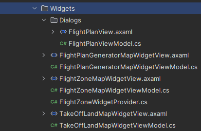

    This folder contains classes and views that implement widgets used in this plugin. **FlightZoneMapWidget** is displayed in the right side of the main screen and is used to change flight zone points location or delete them. **TakeOffLandMapWidget** is used to change take off and land points location or delete them. **FlightPlanGeneratorMapWidget** is used to fill in other flight zone relevant data, such as altitude of flight, date of flight and other information. It is later used to form Flight Plan data that can be used to request flight permission from authorities. **FlightPlanView** is a dialog popup that displays generated Flight Plan data. There is also a **FlightZoneWidgetProvider** class, which we will discuss in the next section of this guide.

### Code Explanation

#### Basic Code Structure

The basics of code structure are the same as for any other MVVM application, written using Avalonia UI. You can check out more details about this topic in our Weather Plugin example written above.

#### Interaction between plugin and main software

Now lets discuss how plugins can interact with main projects codebase. For example, **FlightZoneWidgetProvider** class is used to create and provide map widget view models for flight zones. It takes in a localization service and configuration as inputs when constructed.

```csharp
using System.ComponentModel.Composition;
using Asv.Cfg;
using Asv.Drones.Gui.Core;
using DynamicData;

namespace Asv.Drones.Gui.Plugin.FlightDocs;

[Export(FlightZoneMapViewModel.UriString, typeof(IViewModelProvider<IMapWidget>))]
[PartCreationPolicy(CreationPolicy.NonShared)]
public class FlightZoneWidgetProvider : ViewModelProviderBase<IMapWidget>
{
    [ImportingConstructor]
    public FlightZoneWidgetProvider(ILocalizationService loc, IConfiguration cfg)
    {
        Source.AddOrUpdate(new FlightZoneMapWidgetViewModel(loc));
        Source.AddOrUpdate(new TakeOffLandMapWidgetViewModel(loc));
        Source.AddOrUpdate(new FlightPlanGeneratorMapWidgetViewModel(loc, cfg));
    }
}
```

The main purpose of this class is to create view model instances for different map widgets related to flight zones and add them to the Source collection. It does this by calling the AddOrUpdate method in the constructor, passing new instances of the **FlightZoneMapWidgetViewModel**, **TakeOffLandMapWidgetViewModel**, and **FlightPlanGeneratorMapWidgetViewModel** classes. These view model classes are specific to different flight zone related map widgets. The **FlightZoneWidgetProvider** doesn't contain the implementation logic for these view models. It just handles creating them and adding them to the Source collection. The Source collection property is from the base **ViewModelProviderBase** class, which is a Core class from parent project asv-drones. This contains the view model instances that this provider creates. Other code can then get the appropriate view model from this Source collection for a given map widget type.

So in summary, the **FlightZoneWidgetProvider** class is responsible for creating and providing the view models for flight zone related map widgets. It encapsulates the view model creation logic in one place and exposes the view models through the Source collection for other code to use. This allows separating the view model creation from the consumption.

Another good example is **FlightZoneMapAnchorProvider** class, because it can update it's items dynamically. It is used to provide map anchor data to a flight zone map view model.

```csharp
using System.ComponentModel.Composition;
using Asv.Common;
using Asv.Drones.Gui.Core;
using DynamicData;

namespace Asv.Drones.Gui.Plugin.FlightDocs;

[Export(FlightZoneMapViewModel.UriString, typeof(IViewModelProvider<IMapAnchor>))]
[PartCreationPolicy(CreationPolicy.NonShared)]
public class FlightZoneMapAnchorProvider : ViewModelProviderBase<IMapAnchor>
{
    [ImportingConstructor]
    public FlightZoneMapAnchorProvider()
    {
        
    }

    public void Update(SourceList<IMapAnchor> anchors)
    {
        anchors.Connect()
            .OnItemAdded(_ => Source.AddOrUpdate(_))
            .OnItemRemoved(_ => Source.Remove(_))
            .Subscribe()
            .DisposeItWith(Disposable);
    }
}
```

It takes in a SourceList of IMapAnchor objects as input via the Update method. The IMapAnchor objects contain the data for the anchors to display on the map (e.g. location coordinates, title, etc.). The Update method subscribes to events on the input SourceList to keep the **FlightZoneMapAnchorProvider's** own Source property in sync. When anchors are added or removed from the input, it adds or removes them from its own Source respectively. The Source property is used as the output - it contains the latest set of IMapAnchor objects that should be displayed on the map. By syncing it to the input SourceList, it ensures the map view model always has the updated anchor data.

**The main logic flow is:**

**1. The Update method is called with a SourceList containing map anchors**

**2. It subscribes to events on that SourceList**

**3. When anchors are added/removed from the input, it updates its own Source property accordingly**

**4. The Source property is used by the map view model to show the anchors**

So in summary, the **FlightZoneMapAnchorProvider** acts as a bridge between an input SourceList of anchors and the view model. It propagates changes to the anchors to keep the view model up to date. This allows the view model to always display the latest anchor data.
